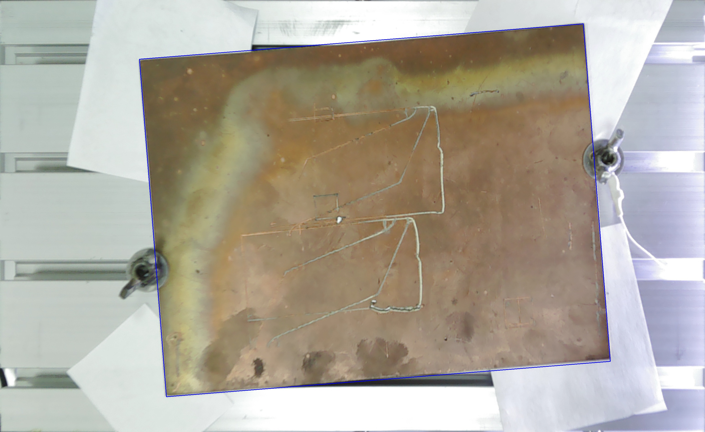

# О возможном подходе к решению задачи об интеллектуальной индентификации заготовки печатной платы на рабочей области CNC станка

*Рассматривается возможный подход к решению задачи об интеллектуальной индентификации заготовки печатной платы на рабочей области CNC станка. С применением методов ....*

***Ключевые слова:*** Изготовление печатных плат, CNC станок, идентификация рабочей области, OpenCV, Canny.

**Введение.** При изготовлении печатных плат, изделие, состоящее из плоского изоляционного основания с отверстиями, пазами, вырезами и системой токопроводящих полосок металла (проводников), которое используют для установки и коммутации электрорадиоизделия (ЭРИ) и функциональных узлов в соответствии с электрической принципиальной схемой, на CNC станке одним из важных этапов является определение координат расположения заготовки. От точности определения координат заготовки зависит дальнейшее качество изготовления продукта. Так же высокая точность позволяет сделать так чтобы можно было фигачить с двух сторон, переворачивать платы как хочешь, и не портить рабочий стол при фрезеровки и сверлении сразу нафиг насквозь.

**Обзор аналогов.**

Обзор чего есть:

Исследователи из Орхусского университета [6] разрабатывают систе-
му ЧПУ для лазерного резака на основе комбинирования маркеров и дополненной реально-
сти. Система основана на подходе WYSIWYG*, где проектор используется для отображения
текущих контуров, а маркеры используются для установки его положения в рабочей области.
*
What You See Is What You Get (англ.) — что видите, то и получаете
ИЗВ. ВУЗОВ. ПРИБОРОСТРОЕНИЕ. 2020. Т. 63, № 9832
М. Я. Афанасьев, Ю. В. Федосов, А. А. Крылова, С. А. Шорохов
Наряду с этим специалисты университета Кейо [7] расширяют функциональность фиду-
циальных* маркеров для лазерного резака. Чтобы установить параметры резки, они разме-
щают набор маркеров опорных точек рядом с заготовкой, в том числе метки, связанные с ма-
териалом, порядком операций и командами.
В работе [8] описан способ обнаружения ошибок контура на основе машинного зрения.
Разработан специальный измерительный прибор с нанесенными на него маркерами, который
позволяет измерять погрешность контура без сетчатого датчика.
В работе [9] предлагается метод прямой симуляции обрабатывающего инструмента
станка. Здесь маркеры используются для определения положения инструмента и заготовки;
дополненная реальность — для моделирования траектории инструмента при обработке. 

**Обзор трёхкоординатной устновки CNC-станка для производства печатных плат.** Помимо стандартных компонентов трёхкоординтной системы (шаговые двигатели, рабочий стол, инструмент), на установке (Рисунок 1) присутствуют две камеры, общего вида и уточняющая, которые являются компонентами системы технического зрения для определения координат заготовки. Камера общего вида жёстко закрепленна на основании станка, так же система может способна рабочий стол в область видимости камеры, что обеспечивает повторяемость обработки. Уточняющяя камера жестко закреплена на рабочем инструменте станка, что позволяет проводить измерения в произвольном месте рабочего стола. \\ можно и без неё но так инфы больше //

Рисунок 1. Трёхкоординатная устновка CNC-станка для производства печатных плат

Все вычисления и управление шаговыми двигателями выполняются при использовании микрокомпьютера Raspberry Pi. Система разрабатывалась на языке программирования Python 3.9 при использовании библиотки OpenCV 4.1.8, для работы с техническим зрением, библиотека RPi.GPIO, для работы с универсальными портами ввода вывыдо микрокомпьютера, которые управляют механикой станка. Вышеописанные инструменты и средства разработаны продиктованы условиями Технического задания проекта.

**Алгоритм работы системы.** С учетом поставленной задачи и имеющихся средств был разработан алгоритм работы системы идентификации заготовки печатной платы (Рисунок 2).

Рисунок 2. Алгоритм работы системы идентификации заготовки печатной платы

На первом этапе происходит испарвление перспективы изабражения общего вида рабочей области. Данный этап присутствует ввиду технической несовершенности механики станка и способа закрпления камеры, что приводит к искривленному изабражению заготовки. Для исправления перспективы съемка велась таким образом, чтобы было видно больше чем рабочий стол, в графическом редакторе были получены координаты четырёх углов стола и требуемые координаты для исправления перспективы, из полученных данных можно получить матрицу преобразований, воспользовавшись функцией cv2.getPerspectiveTransform (src, dst) [OpenCV], и её применить к изображению, пропустив изображение через функцию cv2.warpPerspective (src, M, dsize)[OpenCV], которая и вернёт нам исправленное изображение. Остаётся только обрезать изображение по рабочему столу и передать полученное изображение следующим функциям системы. 

На втором этапе выполняется идентификация заготовки на изображении общего вида рабочей области. В работе [статья шефа] рассмотрено решение подобной задачи, но в условиях нашей задачи мы можем упростить работу, так как мы знаем размер искомой заготовки, заготовка проадаётся в магазине с известными параметрами. Применив функцию cv2.findContours()[OpenCV], мы получим список всех найденных на изображении контуров. Посчитав переметр каждого контура и зная периметр искомого, выбираем нужный контур и передаём координаты углов контура следующим функциям системы (Рисунок 3).

Рисунок 3. Результат идентификации контура заготовки печатной платы по изображению с камеры общего вида

Рисунок 4. Результат идентификации угла заготовки печатной платы по изображению с уточняющей камеры
