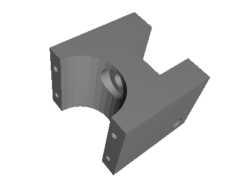
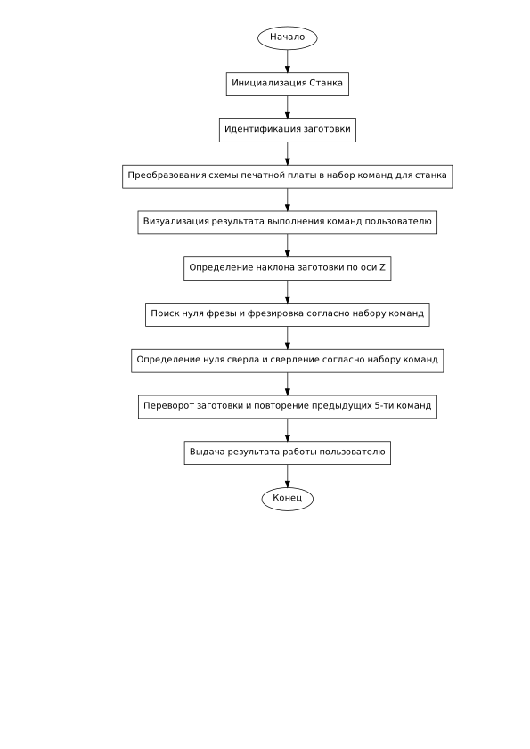

# Разработка интеллектуальной системы управления процессом изготовления печатных плат для CNC станка

## **СОДЕРЖАНИЕ**

//каким-то чудом сгенерируем содержание в libroofice, никогда не получалось

## **ТЕРМИНЫ И ОПРЕДЕЛЕНИЯ**

//Напишем термины и определения, чтобы не облажаться на защите

CNC станок - станок с числовым программным управлением

Raspberry Pi - 

Python - 

Opencv - 

GPIO - 

## **ВВЕДЕНИЕ**

**Актуальность темы исследования**. При мелкосерийном или штучном изготовлении электронного оборудования одним из этапов является изготовление печатной платы - изделия, состоящее из плоского изоляционного основания с отверстиями, пазами, вырезами и системой проводников, которое используют для установки компонентов в соответствии с электрической принципиальной схемой. Достаточно часто на этом этапе заготовку печатной платы изготавливают методом фрезеровки и сверления на CNC станке. Для наилучшего качества полученной платы требуется точное определение координат расположения заготовки. Высокая точность определения позволяет производить обработку детали с двух сторон, что необходимо для большинства изделий.

//Ща написал из статьи но надо написать в общем и ссылки на всякие публикации и прочее

**Объектом исследования** является процесс изготовления печатных плат.

**Предметом исследования** является система управления CNC станком

**Целью исследования** является разработка программно-аппартаной системы управления CNC станком.

Для достижения указанной цели поставлены следующие **задачи**:

1) Анализ существующих систем управления CNC станков для изготовления печатных плат

2) Разработка функциональной схемы системы управления программно аппратной системы управления CNC станка

3) Схемотехническое проектирование аппаратной части  программно-аппартаной системы управления CNC станка

4) Составление спецификации аппаратной части программно-аппартаной системы управления CNC станка

5) Сборка и тестирование аппаратной части  системы управления CNC станка

6) Разработка алгоритмов управления программно-аппартаной системы управления CNC станка

7) Разработка программного обеспечения  программно-аппартаной системы управления CNC станка

8) Тестирование программно-аппартаной системы управления CNC станка

## **ГЛАВА1. АНАЛИЗ СУЩЕСТВУЮЩИХ СИСТЕМ УПРАВЛЕНИЯ CNC СТАНКОВ ДЛЯ ИЗГОТОВЛЕНИЯ ПЕЧАТНЫХ ПЛАТ**

Существует множество систем управления CNC станков для изготовления печатных плат, каждая из которых имеет свои преимущества и недостатки.

Одной из самых популярных систем является Mach3. Она обладает широким набором функций, позволяющих контролировать все аспекты процесса производства печатных плат. Mach3 легко настраивается и поддерживает множество форматов файлов. Однако, она может быть довольно сложной в использовании для новичков.

Еще одной популярной системой управления является LinuxCNC. Она имеет открытый исходный код, что позволяет пользователям настраивать ее под свои нужды. LinuxCNC также обладает широким набором функций и поддерживает множество форматов файлов. Однако, ее настройка может быть сложной для тех, кто не знаком с Linux.

Система управления CNC станками от Bantam Tools также заслуживает внимания. Она разработана специально для изготовления печатных плат и имеет простой интерфейс, что делает ее легкой в использовании. Однако, она может быть менее гибкой по сравнению с другими системами управления.

Наконец, стоит упомянуть систему управления CNC станками от Roland. Она имеет простой интерфейс и широкий набор функций, включая возможность использования автоматической загрузки и выгрузки материалов. Однако, она может быть довольно дорогой по сравнению с другими системами управления.

В целом, выбор системы управления CNC станками для изготовления печатных плат зависит от индивидуальных потребностей и уровня опыта пользователя. Каждая из перечисленных систем имеет свои преимущества и недостатки, поэтому важно тщательно изучить каждую из них перед принятием решения.

### **Выводы по главе 1**

## **ГЛАВА 2. ПРОЕКТИРОВАНИЕ  ПРОГРАММНО-АППРАТНОЙ СИСТЕМЫ УПРАВЛЕНИЯ CNC СТАНКА**

### **2.1. Разработка функциональной схемы системы управления программно-аппратной системы управления cnc станка**

С учетом поставленной задачи и имеющихся средств была разработана Функциональная схема системы управления программно-аппратной системы управления cnc станка (Рисунок 2).


### **2.2. Схемотехническое проектирование аппаратной части  программно-аппартаной системы управления CNC станка**

Схемотехническое проектирование аппаратной части  программно-аппартаной системы управления CNC станка заключается в разработке принципиальной схемы устройства (рисунок 3).


### **2.3. Составление спецификации аппаратной части программно-аппартаной системы управления cnc станка**

На основании принципиальной схемы устройства была составлена спецификация аппаратной части программно-аппартаной системы управления cnc станка (Таблица 1).

Таблица 1. Спецификация аппаратной части программно-аппартаной системы управления cnc станка.

|**№**|**Наименование**|**Количество**|
|:-:|:-|:-:|
|1|Блок Питания с кнопкой выключения (24Вб 12В, 5В)|1|
|2|Raspberry PI 4 B|1|
|3|Карта памяти Micro Sd 128 Гб|1|
|4|CNC Shield|1|
|5|Драйвер шагового двигателя A4988 с радиатором|3|
|6|Шаговый двигатель Nemo 17|3|
|7|Двигатель навесного оборудования|1|
|8|Концевой датчик|4|
|9|USB камера|2|
|10|Каркас станка|1|
|11|Светодиодная лента|1|
|12|Вентилятор охлаждения|3|

### **2.4. Сборка и тестирование аппаратной части  системы управления cnc станка**

Каркас станка был взаимствован от пройстешего китайского CNC станка. Для дальнейшей сборки аппаратной части станка необходимо было смоделировать ряд деталей и корпусов. При помощи среды моделирования Blender подготовлена модель крышки для камеры показанная на рисунке. 


Рисунок . Модель крышки для камеры.

Разработана модель держателя камеры показанная на рисунке. 


Рисунок . Модель держателя камеры.

модель платы корпуса драйверов показанная на рисунке. 


Рисунок . Модель платы корпуса драйверов.

Подготовлена модель крышки корпуса драйверов показанная на рисунке. 


Рисунок . Модель крышки корпуса драйверов.

Подготовлена модель концевого упора x показанная на рисунке. 


Рисунок . Модель концевого упора x.

модель концевого упора y показанная на рисунке. 


Рисунок . Модель концевого упора y.

Была создана модель концевого упора z показанная на рисунке. 


Рисунок . Модель концевого упора z.

Была разработана модель держателя лазерного датчика показанная на рисунке. 


Рисунок . Модель держателя лазерного датчика.

При помощи среды моделирования Blender подготовлена модель заднего левого правого разъема основного корпуса показанная на рисунке. 


Рисунок . Модель заднего левого правого разъема основного корпуса.

модель задней части основного корпуса показанная на рисунке. 


Рисунок . Модель задней части основного корпуса.

При помощи среды моделирования Blender подготовлена модель левыого и правого разъемов крышки основного корпуса  показанная на рисунке. 


Рисунок . Модель левыого и правого разъемов крышки основного корпуса.

Была разработана модель крышки основного корпуса показанная на рисунке. 


Рисунок . Модель крышки основного корпуса.

Была разработана модель левой части основного корпуса  показанная на рисунке. 


Рисунок . Модель левой части основного корпуса.

При помощи среды моделирования Blender подготовлена модель основного корпуса, подставки для raspberry pi  показанная на рисунке. 


Рисунок . Модель основного корпуса, подставки для raspberry pi.

Была создана модель правой части основного корпуса  показанная на рисунке. 


Рисунок . Модель правой части основного корпуса.

Модель верхней части главного корпуса показанная на рисунке. 


Рисунок . Модель верхней части главного корпуса.

Подготовлена модель верхней части корпуса показанная на рисунке. 


Рисунок . Модель верхней части корпуса.

Разработана модель верхнего левого правого угла основного корпуса показанная на рисунке. 


Рисунок . Модель верхнего левого правого угла основного корпуса.

При помощи среды моделирования Blender подготовлена модель держателя блока питания показанная на рисунке. 


Рисунок . Модель держателя блока питания.

Была создана модель дистанцонной шайбы показанная на рисунке. 


Рисунок . Модель дистанцонной шайбы.

Разработана первая часть модели крепления камеры общего вида показанная на рисунке. 



Рисунок . Первая часть модели крепления камеры общего вида.

Разработана вторая часть модели крепления камеры общего вида показанная на рисунке. 


Рисунок . Вторая часть модели крепления камеры общего вида.

Все модели были подготовлены к печати программным комплексом cura [] и смонтированы на столе. Все компоненты электрической части были собранны и смонтированы в специально изготовленных и подготовленных для них мест. Так же, были написаны тестовые программы для тестирования камер, шаговых двигателей концевых датчиков. Результат тестирования показал, что все устройства были подключены верно и работают исправно.
Внешний вид полученного устройства показан на рис.


Рисунок . Устройство в сборе

### **Выводы по главе 2**

В этой главе было подготовленно и согласовано с руководителем (Приложение не знаю какое) техническое задание к проекту, согласно которому была разработана, изготовленна, собранна и протестированна аппаратная часть станка. 

## ГЛАВА 3. РАЗРАБОТКА ПРОГРАММНОГО ОБЕСПЕЧЕНИЯ  ПРОГРАММНО-АППАРТАНОЙ СИСТЕМОЙ УПРАВЛЕНИЯ CNC СТАНКА

### **3.1. Разработка алгоритмов управления программно-аппартаной системы управления cnc станка**

Перед началом разработки программного обеспечения  программно-аппартаной системой управления cnc станка, наобходимо разработать общий алгоритм работы системы и, при необходимости, разработать алгоритмы её подсистем. Общай алгороитм работы системы представлен на рисунке .



Рисунок . Общий алгоритм работы системы

После включения станка мы не можем точно определить его настоящие координаты, для этого нужно вывести все координаты в ноль, используя концевые датчики, в этом и заключается этап "Инициализация Станка". После инициализации необходимо провести этап "Идентификации заготовки", считается, что пользователь надежно закрепил её перед включения станка. После того как мы определили местоположение заготовки, по полученным данным от пользователя об схеме платы надо преобразовать их в набор команд, и, после успешного завершения данного этапа, необходимо визуализировать полученный результат пользователю. После подтверждения от пользователя об правельности обработки данных, следует определить наклон плат по оси Z, необходимость проведения данного этаапа связана с несовершенностью изготовления рабочей области, дефектностью закрепления заготовки. После этого находим высоту рабочего инструмента и выполняем набор команд. После успешной обработки первой стороны печатной платы, отдаём сообщение пользователю об необходимости переворота заготовки на вторую сторону и повторяем операции по поиску заготовки, преобразования входных данных в набор команд, визуализации, определение наклона и выполнению набора команд. После успешной обработки второй стороны печатной платы, выполняем инициализацию по осям Z и X, отъезжаем осью Y на максимально возможное расстояние и выдаем сообщение пользователю об успешном завершении работы, в чём и заключается последний этап работы системы "Выдача результата работы пользователю".

Рассмотрим подробнее алгоритм работы системы инициализации станка (Рисунок ).


Рисунок . Алгоритм системы инициализации станка

Инициализация станка начинается с выведении в ноль оси Z, это необходимо для предотвращения поломки рабочего инструмента. Сначала на повышенной скорости выполняется перемещение по оси Z до срабатывания концевого датчика, после этого отъезжаем от датчика на расстояние, на котором датчик уже точно не будет нажат. Далее на малой скорости  подъезжаем к датчику до его срабатывания, после, отъежаем от него пока датчик не будет отжат. Двойной подъезд и отъезд от датчика повышает точность позиционирования. После успешной инициализации по оси Z повторяем теже опреации с осями X и Y.

С учетом поставленной задачи и имеющихся средств был разработан алгоритм работы системы идентификации заготовки печатной платы (Рисунок 2).


Рисунок . Алгоритм работы системы идентификации заготовки печатной платы

Алгоритм системы идентификации заготовки печатной платы начианется с перемещения рабочего стола в область видимости основной камеры и получения с неё изображения. Ввиду несовершенства станка, камеры и способа крепления камеры, необходимо выполнить испарвление перспективы, после этого выполняем идентификацию заготовки. Когда мы получили координаты углов контура платы по изображению с основной камеры, надо перевести эти координаты из пикселей в миллиметры и уточнить все координаты вершин по дополнительной камере, после успешного завершения этого этапа, можно отдавать полученные координаты дургим системам управления станком.

Последним рассмотрим алгоритм системы преобразования схемы в набор команд (Рисунок ).


Рисунок . Алгоритм системы преобразования схемы в набор команд.

От пользователя системы мы получаем .drl файл (файл сверловки) платы, Bitmap файл схемы платы, размеры сторон платы и заготовки, на первом этапе работы системы преобразования схемы в набор команд происходит разбор файла сверловки платы, по полученным данным на рисунке схемы платы закрашиваем отверстия под компоненты платы, для дальнейшего успешного выполнения определния контуров платы. Далее переводим координаты контуров из пикселей в мииллиметры и перемещаем и поворочиваем на основании данных полученных даныых от описанной выше системы.

### **3.2. Реализация программного обеспечения  программно-аппартаной системой управления CNC станка**

Программно-аппаратная система управления начинается с инициализации необходимых портов GPIO (Листинг ...). 

Листинг . Функция инициализации портов GPIO Raspberry Pi.
```python
    def __init_gpio__(self):
        self.gpio.setmode(self.gpio.BOARD)
        self.gpio.setwarnings(True)
        self.gpio.setup([self.config.X_END, self.config.Y_END, self.config.Z_END, self.config.F_END], self.gpio.IN, pull_up_down=self.gpio.PUD_UP)
    
        self.gpio.setup([self.config.x_St, self.config.x_Dr, self.config.x_En], self.gpio.OUT, initial=self.gpio.LOW)
        self.gpio.output(self.config.x_En, 1)
    
        self.gpio.setup([self.config.y_St, self.config.y_Dr, self.config.y_En], self.gpio.OUT, initial=self.gpio.LOW)
        self.gpio.output(self.config.y_En, 1)
    
        self.gpio.setup([self.config.z_St, self.config.z_Dr, self.config.z_En], self.gpio.OUT, initial=self.gpio.LOW)
        self.gpio.output(self.config.z_En, 1)

        FREQUENCY = 100
    
        self.gpio.setup(self.config.Freza, self.gpio.OUT)
        self.freza = self.gpio.PWM(self.config.Freza, FREQUENCY)
```

В начале происходит выбор способа нумерации пинов GPIO методом setmode() модуля Rpi.GPIO [], был выбран метод нумерациии BOARD, так как он обеспечивает работоспособность оборудования независимо от версии микрокомпьютера Raspberyy Pi. Далее методом setwarnings() были включенны предупреждения, на случай если какой-то контакт был настроенн и используется другим скриптом в системе. После, настраиваются пины концевых датчиков, управления драйверами шаговых двигателей и настраивается ШИМ [] управления навесным оборудованием.

После настройки пинов ввода-вывода можно заниматься перемещением рабочего стола, для этого необходимы функции управления перемещением (Листинг ....).

Листинг . Функции управления перемещения шаговым двигателем по оси X.
```python
def x_go(self, mm, speed_x = 1):
    steps = mm * self.config.X_STEPS_MM
    self.gpio.output(self.config.x_En, 0)
    d = self.FRW if steps > 0 else self.BCK
    for i in range(abs(steps)):
        self.x_step(d, speed_x)
    self.gpio.output(self.config.x_En, 1)

def x_step(self, direction, speed_x):
    d = 1 if direction == self.FRW else 0
    self.gpio.output(self.config.x_St, 0)
    self.gpio.output(self.config.x_Dr, d)
    sleep((round(round((pow(speed_x * 800, -1) * pow(10, 5))) / 2)) * 10**-6)
    self.gpio.output(self.config.x_St, 1)
    self.gpio.output(self.config.x_Dr, d)
    sleep((round(round((pow(speed_x * 800, -1) * pow(10, 5))) / 2)) * 10**-6) 
    self.coordinates[self.coor_x] += direction * 125
```

Функции управления шаговым двигателем на оси Х x_go(), а так же аналогичные ей функции управления по осям Y и Z,  передаются  расстояние, на которое надо переместиться, в миллиметрах, а так же желаемая скорость. В ней рассчитывается необходимое количество шагов для шагового двигателя, определяется направление для перемещения, далее передаются сигнал драйверу шагового двигателя на включение и выполняются необходимое количество шагов функцией x_step(), написанной на основании документации к драйверу [], в котрой так же подсчитывается пройденное расстояние в десятитысячных долях миллиметра. После выполнения всех шагов передаётся сигнал драйверу шагового двигателя на выключение.

В начале работы системы необходимо провести этап инициализации станка (Листинг ).

Листинг . Функция инициализации по оси X.
```python
def __init_axis_x__(self):
        count = 0
        while((self.gpio.input(self.config.X_END)) and (count < 270)):
            self.x_go(-100, 1)
            count += 1
        self.x_go(500, 1)
        count = 0
        while((self.gpio.input(self.config.X_END)) and (count < 500)):
            self.x_go(-1, 0.05)
            count += 1
        while(not (self.gpio.input(self.config.X_END))):
            self.x_go(1, 0.1)
        self.coordinates[self.coor_x] = 0
```

На Листинге юю представленна функция инициализации оси X, функции инициализации по осям X и Y аналогичны, реализованная согласно алгоритму описанному в части 3.1, в конце которой обнуляется координата оси X в списке хранения координат.

После инициализации станка можно начинать с ним работу, для перемещения рабочего инструмента в заданные координаты необходима соответствующая функция (Листинг юююю).

Листинг . Функция перемещения инструмента станка в заданные координаты по осям X и Y.
```python
	def go_to_coor(self, x, y):
        dx = x - int(self.coordinates[self.coor_x] / 1000)
        dy = y - int(self.coordinates[self.coor_y] / 1000)
        self.x_go(dx, 1)
        self.y_go(dy, 1)
```

Функции go_to_coor() (Листинг ююю) передаются желаемые координаты для перемещения по осям X и Y в сотых долях миллиметра. В начале рассчитывается смещение по двум осям как разность желаемого и текущего значения координат, после полученное значение смещения передаётся функциям x_go() и y_go().

Для работы системы идентификации заготовки рабочей области необходима функция получения изображения с камеры Общего вида и Уточненяющей (Листинг ююю).

Листинг . Функция получения изображения с нужной камеры.
```python
    def get_frames(self, id):
        cam = cv.VideoCapture(id)
        assert cam.isOpened()
        cam.set(3, 1920)
        cam.set(4, 1080)
        out = np.zeros((int(cam.get(4)*2),int(cam.get(3)*2), 3))
        for i in range(10):
            out[::2 ,  ::2] = cam.read()[1]
            out[::2 , 1::2] = cam.read()[1]
            out[1::2,  ::2] = cam.read()[1]
            out[1::2, 1::2] = cam.read()[1]
        return out
```

Методу get_frames() передаётся id номер камеры, далее создаётся экземпляр класса cv.VideoCapture(id) с нужным номером камеры и проверяется исправность её открытия. После чего настраиваются бозовые свойства камеры и из четырёх последовательно полученных с камеры изображений пользователю отдаётся кадр повышенного в два раза, чем стандартное, разрешения.

Ввиду несовершенства изготовления аппаратной части станка, необходимо исправить перспективу у изображения с основной камеры, для чего необходимо написать соответствующий код (Листинг ююююю).

Листинг . Функция испарвления перспективы с основной камеры.
```python
    def correcting_perspective(self, img):
        pt_A = [212,  284 ] 
        pt_B = [212,  2097] 
        pt_C = [3294, 2033]
        pt_D = [3208, 207 ]

        input_pts = np.float32([pt_A, pt_B, pt_C, pt_D])
        output_pts = np.float32([[210, 204],
                                [210, 2097], 
                                [3296, 2097], 
                                [3296, 204]])
        M = cv.getPerspectiveTransform(input_pts,output_pts)
        out = cv.warpPerspective(img,M,(img.shape[1],img.shape[0]),flags=cv.INTER_LINEAR)
        return out[204:2097, 210:3296]
```

Для исправления перспективы съемка велась таким образом, чтобы рабочий стол помещался в поле зрения камеры с достаточными "полями", затем в графическом редакторе были получены фактические  координаты четырёх углов стола и требуемые координаты для исправления перспективы, из полученных данных строилась матрица преобразования при помощи функции cv2.getPerspectiveTransform (src, dst) [9]. При её применении к изображению, а также пропустив изображение через функцию cv2.warpPerspective (src, M, dsize) [9] мы получаем  изображение в нужной проекции. Остаётся только обрезать изображение по контуру рабочего стола и передать его следующим функциям системы. 

Следующий этап работы системы - это определение координат углов контура заготовки по Основной камере (Листинг юююю).

Листинг . Функция определения координат углов контура заготовки по Основной камере.
```python
    def find_board_by_cam_two(self, img_path, req_diagonal, min_side, max_side):
        out_coor = list()
        hsv_min = np.array((0, 54, 5), np.uint8)
        hsv_max = np.array((187, 255, 253), np.uint8)
        img = cv.imread(img_path)
        hsv = cv.cvtColor( img, cv.COLOR_BGR2HSV ) 
        thresh = cv.inRange( hsv, hsv_min, hsv_max )
        contours0, hierarche = cv.findContours(thresh.copy(), cv.RETR_TREE, cv.CHAIN_APPROX_SIMPLE)
        for cnt in contours0:
            rect = cv.minAreaRect(cnt)
            box = cv.boxPoints(rect)
            box = np.int0(box)
            diagonal_ = self.get_diagonal(box) / 10.286
            min_side_, max_side_ = self.det_min_max_side(box)
            if ((diagonal_ < req_diagonal + 15) and (diagonal_ > req_diagonal - 15)) and ((min_side_ < min_side + 10) and (min_side_ > min_side - 10)) and ((max_side_ < max_side + 10) and (max_side_ > max_side - 10)):
                out_coor = box
                cv.drawContours(img,[box],0,(255,0,0),12)
                cv.imwrite('/tmp/'+str(img_path.split('/')[-1].split('.')[0]) + '_' + str(int(time())%1000) + '.jpg',img)
        return out_coor
```

В работе [5] рассмотрено решение подобной задачи, но в условиях нашей задачи мы можем упростить работу, так как мы знаем размер заготовки (заготовки печатных плат имеют известные параметры ширины, выстоты и толщины) [10]. Применив функцию cv2.findContours() [9], мы получим список всех найденных на изображении контуров. Посчитав диагональ, меньшую и большую стороны каждого контура и зная диагональ, меньшую и большую стороны искомого, выбираем нужный контур и передаём координаты углов контура следующим функциям системы (рис. 3).


Рисунок  . Результат идентификации контура заготовки печатной платы по изображению с Основной камеры.

Далле рассмотрим программу уточнения координат заготовки печатной платы (Листинг ).

Листинг . Программа уточнения координат заготовки печатной платы.
```python
	def find_corner_by_cam_one(self, img):
        img = img
        gray = cv.cvtColor(img,cv.COLOR_BGR2GRAY)
        edges = cv.Canny(gray,100,200,apertureSize = 3)
        lines = cv.HoughLinesP(edges,1,np.pi/180,2,minLineLength=30,maxLineGap=10)
        vertical, horizontal, img = self.get_vertical_and_horizontal(lines, img)

        best_vertical = self.get_best_vertical(vertical)
        best_horisontal = self.get_best_horizontal(horizontal)

        line1 = Line(Point(best_vertical[0], best_vertical[1]), Point(best_vertical[2], best_vertical[3]))
        line2 = Line(Point(best_horisontal[0], best_horisontal[1]), Point(best_horisontal[2], best_horisontal[3]))
        intersect = line1.intersection(line2)
        if len(str(intersect[0][0]).split('/')) > 1:
            x_intersection = int(str(intersect[0][0]).split('/')[0]) / int(str(intersect[0][0]).split('/')[1])
        else:
            x_intersection = int(str(intersect[0][0]))
        if len(str(intersect[0][1]).split('/')) > 1:
            y_intersection = int(str(intersect[0][1]).split('/')[0]) / int(str(intersect[0][1]).split('/')[1])
        else:
            y_intersection = int(str(intersect[0][1]))
        return (640 - x_intersection)/34.5 , (480 - y_intersection)/35, img

for corner in coor_for_cam_one:
    stanok.go_to_coor(corner[0], corner[1])
    stanok.z_go(1500, 1)
    t = str(int(time())%100000)
    img = stanok.get_frames(2)
    cv.imwrite(f'/tmp/out_{2}_{t}.jpeg', img)
    img = fwa.rotate(f'/tmp/out_{2}_{t}.jpeg', angle = 1.8)
    dx, dy, img = fwa.find_corner_by_cam_one(img)
    dx = int(round(dx, 2) * 100)
    dy = int(round(dy, 2) * 100)
    count = 0
    while ((count > 150) or ((dx**2 + dy**2)**0.5 > 10)):
        stanok.x_go(-dx, 1)
        stanok.y_go(dy, 1)
        img = stanok.get_frames(2)
        t = str(int(time())%100000)
        cv.imwrite(f'/tmp/out_{2}_{t}.jpeg', img)
        img = fwa.rotate(f'/tmp/out_{2}_{t}.jpeg', angle = 1.8)
        dx, dy, img = fwa.find_corner_by_cam_one(img)
        dx = int(round(dx, 2) * 100)
        dy = int(round(dy, 2) * 100)
        ount += 1
    print(stanok.coordinates)
    stanok.__init_axis_z__()
    coor_of_plate += [stanok.coordinates]
print(coor_of_plate)
```


Рисунок  - Результат идентификации угла заготовки печатной платы по изображению с уточняющей камеры.

На этом этапе необходимо выполнить уточнение координат угла заготовки печатной платы по дополнительной камере. Получив на предыдущем шаге координату угла контура, нообходимо переместить центр камеры по этой координате и получить снимок. Последующие алгоритмы потребуют работу с изображением в двухканальном представлении, для этого применим к исходному изображению функцию cv2.cvtColor(img, cv2.COLOR_BGR2GRAY) [9], где img - это исходное изображение, а cv2.COLOR_BGR2GRAY - требуемый цветовой фильтр. В работе [5] приведено преимущество использования метода сегментации Канни [6], который мы и применим к нашему изображению, получив изображение с краями. Эту информацию необходимо отдать на обработку функции cv2.HoughLinesP [9], которая отдаст нам все линии на изображении. Далее разделим линии на две группы: те которые "более горизонтальные" и те которые "более вертикальные". Мы можем так поступить т.к. заготовка изначально имеет прямоугольную форму. Из каждой группы необходимо методом кластеризации выбрать линюю, вокруг которой будет больше всего точек, образующих контуры, эта линии и будут образовывать вертикальный и горизонтальный край заготовки. Наконец надо определить точку пересечения этих линий - это угол платы, а так же посчитать смещение относительно центра снимка.

Далее, переместив камеру на найденное смещение, повторяем вышеописанную процедуру, пока смещение не составит меньше чем одна десятая доля миллиметра. Так же повторяем всё это с остальными углами получая уточненное значение углов заготовки (рис. 4). Полученные координаты передаются следующим системам управления CNC-станка.

После того как мы получили координаты углов заготовки печатной платы, желательно приступить к обработке схемы печатной платы. Как уже говорилось ранее, на вход программы поустпает файл сверловки и рисунок печатной платы в формате Bitmap. Начнём с разбора файла сверловки (Листинг ...), пример файла сверловки представлен в Приложении .

Листинг . Код разбора файла сверловки печатной платы.
```python
	f = open('/tmp/test_plate.drl', 'r')
    file = list()
    for line in f:
        file.append(line)
    f.close()

    drills = file[file.index('METRIC\n') + 1 : file.index('%\n', file.index('METRIC\n'))]

    dril_name_mm = list()
    for dril in drills:
        dril_name_mm.append([dril.split('C')[0], dril.split('C')[1].split('\n')[0]])
    print(dril_name_mm)
    
    drill = list()

    for i in range(len(dril_name_mm)):
        if not (i == len(dril_name_mm) - 1):
            coors = file[file.index(f'{dril_name_mm[i][0]}\n') + 1:file.index(f'{dril_name_mm[i + 1][0]}\n')]
            for coor in coors:
                drill.append([float(dril_name_mm[i][1]), int(coor.split('Y-')[0].split('X')[-1]) ,int(coor.split('Y-')[-1])])
        else:
            coors = file[file.index(f'{dril_name_mm[i][0]}\n') + 1:file.index('M30\n')]
            for coor in coors:
                drill.append([float(dril_name_mm[i][1]), int(coor.split('Y-')[0].split('X')[-1]) ,int(coor.split('Y-')[-1])])
    print(drill)
    for_draw = [[int(point[0] * 40), int((point[1] * 47.25)/100),int((point[2]*47.25)/100)] for point in drill]
    print(for_draw)
    src = cv.imread("/tmp/test_plate.bmp")

    for point in for_draw:
        print(point)
        cv.circle(src, (point[1], point[2]), int(point[0]/200), (0, 255, 0), point[0]*2)
```

Листинг . Код закрашивания отверстий под компоненты на схеме печатной платы.
```python
	imgray = cv.cvtColor(src, cv.COLOR_BGR2GRAY)
    ret, thresh = cv.threshold(imgray, 0, 255, 0)
    contours, hierarchy = cv.findContours(thresh, cv.RETR_TREE, cv.CHAIN_APPROX_SIMPLE)
    cv.drawContours(src, contours, -1, (0, 255, 0), 10)
    imgray = cv.cvtColor(src, cv.COLOR_BGR2GRAY)
    ret, thresh = cv.threshold(imgray, 0, 255, 0)
    contours, hierarchy = cv.findContours(thresh, cv.RETR_TREE, cv.CHAIN_APPROX_SIMPLE)
    cv.drawContours(src, contours, -1, (0, 0, 255), 5)
    print(len(contours[0]))
    plt.imshow(src)
    plt.show()
```


Рисунок . Визуализация возможного результата для пользователя.


Листинг . Функция определения высоты рабочего инструмента.
```python
    def get_zero_freza(self):
        f = 0
        test_coor_z_list = list()
        for i in range(5):
            f = 0
            while( f < 90 and self.coordinates[self.coor_z] < 6000000):
                self.z_go(1, 0.25)
                f = 0
                for i in range(100):
                    f += self.gpio.input(self.config.F_END)
            test_coor_z_list.append(self.coordinates[self.coor_z])
            self.z_go(-400, 4)
        return mean(test_coor_z_list)
```


### **3.3. Тестирование программно-аппартаной системы управления CNC станка**

#### **3.3.1. Тестирование подсистемы позиционирования CNC станка**

Подсистема позиционирования является одним из ключевых элементов CNC станка, которая обеспечивает качество и точность обработки деталей. Поэтому её тестирование является необходиомй процедурой для проверки её работоспособности.

Как уже описывалось ранее, в системе идентификации заготовки печатной платы, нам необходимо передвинуть рабочую область на конкретное расстояние, чтобы она попала в область видимости основной камеры. Предлагаем сравнивать изображения полученные с основной камеры, для оценки качества позиционирования.

Для оценки качества позиционирования, возьмём два изображения, первое возьмём за Исходное, а второе за Тестируемое. Загрузим оба изображения в программу методом cv.imread() [] и преобразуем цветовую палитру в градиции серого аргументом cv.IMREAD_GRAYSCALE [], после вызовем к обоим изображениям метод cv.threshold(), для получения порогового определения изображения с применением бинаризации Оцу, предназначенного для автоматического определения порога изображения, далее вычтем из Тестируемого изображения Исходное и исследуем результат, код этой программы представлен на Листинге (какой-то номер не знаю пока какой).

Листинг . Тестирование определения качества позиционирования.

```python
orig = cv.imread("orig.jpg", cv.IMREAD_GRAYSCALE)
ret, thresh1 = cv.threshold(orig, 0, 255, cv.THRESH_BINARY + cv.THRESH_OTSU)

img = cv.imread("img.jpg", cv.IMREAD_GRAYSCALE)
ret, thresh1 = cv.threshold(img, 0, 255, cv.THRESH_BINARY + cv.THRESH_OTSU)

out = img - orig

plt.subplot(1, 3, 1), plt.imshow(orig, 'gray'), plt.title("orig")
plt.subplot(1, 3, 2), plt.imshow(img, 'gray'), plt.title("img")
plt.subplot(1, 3, 3), plt.imshow(out, 'gray'), plt.title("img - orig")
plt.show()
```


Рисунок . Тестирование алгоритма определения качества позиционирования на подобных фотографиях

При тестировании алгоритма определения качества позиционироания на подобных фотографиях (Рисунок ) мы получили малое отношение белых пикселей к чёрным, а при тестировании алгоритма определения качества позиционирования на различных фотографиях (Рисунок ) мы получаем большее отношение белых пикселей к чёрным, что говорит об правильности выбранного нами метода качественного оценивания позиционирования.


Рисунок . Тестирование алгоритма определения качества позиционирования на различных фотографиях

Получим качественный анализ системы позиционирования, для этого будем проводить инициализацию станка, перемещать рабочее поле в область видимости станка, делать снимок основной камеры и сохранять изображение с основной камеры и так повторять 11 раз. После того как все снимки были полученны, напишем программу (Листинг какой-то номер не знаю пока какой), в которой загрузим все полученные изображения с основной камеры,  получим у них у всех пороговые определения и, приняв первое изображение за Исходное, будем из оставшихся десяти Тестируемых вычетать его. Получим отношения белых пикселей к чёрным и приведем к процетной форме.

Листинг . Алгоритм определения качества позиционирования.

```python
img_paths = glob("/tmp/test_cnc_1/*")

thresholds = list()
for img_path in img_paths:
	img_c = cv.imread(img_path, cv.IMREAD_GRAYSCALE)
    ret, thresh = cv.threshold(img_c, 0, 255, cv.THRESH_BINARY + cv.THRESH_OTSU)
    thresholds.append(thresh)

outs = list()
for i in range(1, len(thrs)):
    out = thrs[i] - thrs[0]
    outs.append(np.sum(out == 255))

print([round((out / 5841798) * 100, 2) for out in outs])

Out[666]: [0.17, 0.42, 0.87, 0.24, 0.22, 0.28, 0.27, 0.32, 0.22, 0.23]
```

Из результата работы программы (Листинг какой-то номер не знаю пока какой) был получен качественный показатель позиционирования, который составил менее 1 процента.

#### **3.3.2. Тестирование системы идентификации заготовки печатной платы**

От системы идентификации заготовки печатной платы зависит точность изготовления платы, так как важно определить её точное местоположение при перевороте заготовки для обработки на обратной стороне. Для выполнения тестирования было проведенно десять определений координат углов контура одной и той же заготовки. Далее была высчитанна погрешность измерений с доверительной вероятностью равной 0.95. Результат тестирования представлен на Рисунке .


Рисунок . Тестирование системы идентификации заготовки печатной платы

Проверка системы идентификации заготовки печатной платы показала удовлетворительный результат.

### **Выводы по главе 3**


## **ЗАКЛЮЧЕНИЕ**

## **СПИСОК ИСПОЛЬЗОВАННЫХ ИСТОЧНИКОВ**

## **ПРИЛОЖЕНИЯ**

### **Приложение А**

### **Приложение Б**

Пример файла сверловки.

>test.drl

>M48
>M71
>T01C0.7
>T02C1.0
>T03C1.5
>%
>G05
>T01
>X02032Y08763
>X02540Y08763
>X02794Y09144
>T02
>X00635Y07874
>X00508Y08636
>X00889Y08636
>X00635Y09017
>X00889Y09525
>X00381Y09525
>X01524Y09398
>X01524Y09652
>X01651Y09017
>X01524Y08382
>X01524Y07874
>X02286Y08255
>X02921Y08763
>X03175Y08763
>X03175Y09271
>X02794Y09525
>X02413Y09144
>X02159Y09525
>X03175Y08001
>T03
>X00508Y08255
>M30

### **Приложение В**


