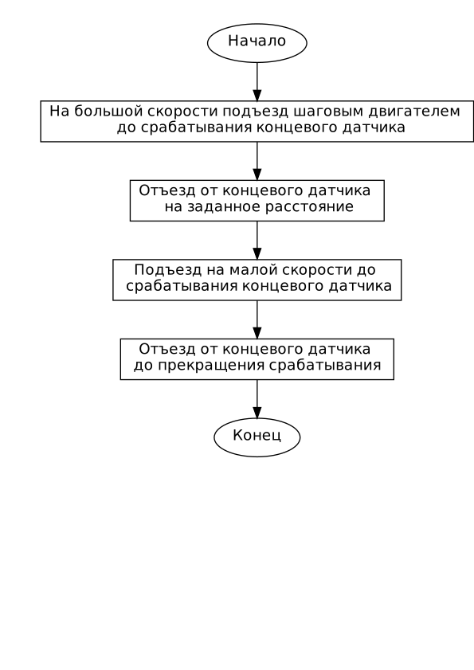
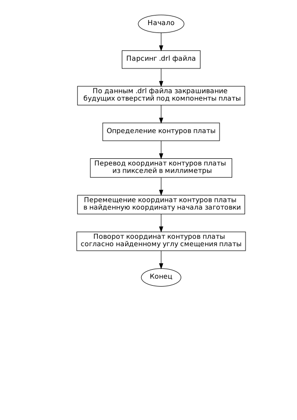

# Разработка интеллектуальной системы управления процессом изготовления печатных плат для CNC станка

## **Реферат.**

Выпускная квалификационная работа состоит из 3 глав, __ стр., 35 рисунков, 1 таблицы, __ источников, 3 приложений.

Ключевые слова: ИЗГОТОВЛЕНИЕ ПЕЧАТНЫХ ПЛАТ, CNC СТАНОК, ИДЕНТИФИКАЦИЯ РАБОЧЕЙ ОБЛАСТИ, OPENCV, CANNY, PYTHON, RASPBERRY PI, ИНТЕЛЛЕКТУАЛЬНАЯ СИСТЕМА УПРАВЛЕНИЯ, МИКРОКОМПЬЮТЕР.

**Объектом исследования** в рамках данной выпускной квалификационной работы является процесс изготовления печатных плат путём прецизионного фрезерования.

**Цель работы**: разработка программно-аппартаной системы управления CNC станком.

В результате выполнеия выпускной квалификационной работы была полученна интеллектулаьная система управления процессом изготовления печатных плат для CNC станка.

**Практическая значимость** выпускной квалификационной работы заключается в получении автоматизированного станка для изготовления печатных плат, которая в будущем возможно позволит сократить время затраченное опретором системы для выделки печатных плат. Разработанные алгоритмы могут быть полезны не только для применения в интеллектуальной системе управления CNC станком для изготовления печатных плат, но и вдругих системах управления ЧПУ станков.

## **Содержание.**

Термины и определения
Перечень сокращений и обозначений
Введение
.....

## **Термины и определения.**

//Напишем термины и определения, чтобы не облажаться на защите

CNC станок - станок с числовым программным управлением

Raspberry Pi - 

Python - 

Opencv - 

GPIO - 

## **Перечень сокращений и обозначений.**

A/D (АЦП) – Analog-to-Digital, аналогово-цифровой преобразователь.

ARM – Advanced RISC Machines, название семейства микропроцессорных ядер.

CMOS (КМОП) – Complementary-symmetry/Metal-Oxide Semiconductor, комплементарная логика на транзисторах металл-оксид-полупроводник. 

EEPROM – Electrically Erasable Programmable Read-Only Memory, электрически стираемое перепрограммируемое постоянное запоминающее устройство.

ISO (ИСО) – International Organization for Standardization, международная организация по стандартизации. 

SCADA – Supervisory Control And Data Acquisition, диспетчерское управление и сбор данных. 

USB – Universal Serial Bus, универсальная последовательная шина.

МАИ – метод анализа иерархий.

МК – микроконтроллер.

ОС – операционная система. 

ПК – персональный компьютер. 

ПУ – периферийное устройство.

ТК – тренажерный комплекс.

## **ВВЕДЕНИЕ**

**Актуальность темы.** При мелкосерийном или штучном изготовлении электронного оборудования одним из этапов является изготовление печатной платы - изделия, состоящее из плоского изоляционного основания с отверстиями, пазами, вырезами и системой проводников, которое используют для установки компонентов в соответствии с электрической принципиальной схемой. Достаточно часто на этом этапе заготовку печатной платы изготавливают методом фрезеровки и сверления на CNC станке. Для наилучшего качества полученной платы требуется точное определение координат расположения заготовки. Высокая точность определения позволяет производить обработку детали с двух сторон, что необходимо для большинства изделий.

Однако, отличный результат не зависит только от качественной системы управления, а так же зависит от совершенного механического исполнения станка, способа крепления заготовки и её идентификации. У описанных ваше систем есть существующая проблема, заключающаяся в трудности определения начала работы. Эта проблема ложится на плечи пользователя, который должен сам позиционировать заготовку под работу станка. Либо она решается специальными штифтами и заранее проделанными отвестиями в заготовке, что иногда не очень удобно. Далее. в работе, будет описан способ решения этой задачи.

CNC-станок для создания печатных плат — это станок, оснащенный  рабочим столом, на котором крепится заготовка из фольгированного стеклотекстолита. Фрезерование печатных плат по сути ничем не отличается от других операций, выполняемых на станках с числовым программным управлением. Преимущество этого метода заключается в том, что он позволяет выполнять обработку с высокой степенью точности при минимальном участии человека в процессе. 

Процесс изготовления печатных на CNC станке начинается с разработки схемы платы в специализированой программе (Sprint Layout, Fritzing и др.). Схема печатной платы экспортируется из программы разработки в Gerber формате, после чего необходимы вычислить траекторию обрабатывающего инструмента (G - код файл) программой Visolate или другой. Когда программа управления будет готова, необходимо выполнить инициализацию станка и прочно закрепить заготовку печатной платы на рабочем столе фрезера, особое внимание уделить параллельности краев заготовки строительным осям станка. Вручную выполнить "поиск 0" - совместить острие инструмента с левым нижним углом заготовки. Запустить программу управления и дождаться её оканчания.

При выделке плат путем прецизионного фрезерования 

**Объектом выпускной квалификационной работы** является процесс изготовления печатных плат.

**Предметом выпускной квалификационной работы** является система управления CNC станком.

**Целью выпускной квалификационной работы** является разработка программно-аппартаной системы управления CNC станком.

Для достижения указанной цели поставлены следующие **задачи**:

1) Анализ существующих систем управления CNC станков для изготовления печатных плат

2) Разработка функциональной схемы системы управления программно аппратной системы управления CNC станка

3) Схемотехническое проектирование аппаратной части  программно-аппартаной системы управления CNC станка

4) Составление спецификации аппаратной части программно-аппартаной системы управления CNC станка

5) Сборка и тестирование аппаратной части  системы управления CNC станка

6) Разработка алгоритмов управления программно-аппартаной системы управления CNC станка

7) Разработка программного обеспечения  программно-аппартаной системы управления CNC станка

8) Тестирование программно-аппартаной системы управления CNC станка

**Актуальность темы.** Современные производственные предприятия используют в своей деятельности  информационные системы (ИС) планирования, учета, анализа и пр. Ввиду специфики и сложности промышленного производства, автоматизация производственных процессов, критичных для функционирования предприятия, востребована и актуальна. Поскольку создание единой ИС, удовлетворяющей запросы не только производства, но и руководства, задача практически нерешаемая, количество используемых систем на предприятии постоянно растет. Некоторые из таких информационных систем разработаны своими силами или посредствам аутсорсинговых организаций, некоторые приобретены как готовое решение для решения узкого круга специализированных задач. 

В ИС предприятия часто обрабатываются одинаковые данные — начиная со справочников и классификаторов. Обычны ситуации, когда в рамках одного бизнес-процесса задействованы гетерогенные (разнородные) информационные системы. Многие информационные системы изначально ориентированы на получение информации из других приложений и баз данных [3]. Взаимодействие между такого рода системами может быть затруднено из-за несопоставимости формата данных, которыми они оперируют, а также возможной доработки тех или иных систем. Вследствие всего этого автоматизация предприятия носит «лоскутный» характер, из чего следует невозможность и обоснованность планирования деятельности предприятия и его финансовых результатов. 

Результатом такой автоматизации является низкая эффективность работы составляющих информационной среды предприятия, увеличение затрат на поддержку, эксплуатацию и развитие, невозможность обеспечить требуемую информационно-учетную и аналитическую поддержку бизнес-процессов на должном уровне и в срок. Именно поэтому у руководства компаний все чаще возникает задача интеграции существующих на предприятии «лоскутных» программных продуктов в единую (комплексную, интегрированную) корпоративную информационную систему (КИС).

Научная новизна диссертационной работы заключается в интеграции системы фигурного раскроя листового материала с информационной системой промышленного предприятия как бизнес-процесса и разработке подхода к интеграции систем.
Интегрированная КИС позволит:
сохранить ранее сделанные инвестиции, временные и финансовые затраты на поддержку и развитие информационного пространства предприятия;
использовать для решения конкретных задач наиболее эффективные системы отдельных производителей;
легко расширять и развивать отдельные возможности существующих информационных систем с уже накопленными в них данными [3].

**Объектом исследования** ВКР является процесс интеграции программного комплекса фигурного раскроя листового материала с информационной системой предприятия. 
Предметом исследования является интеграция комплекса фигурного раскроя листового материала с информационной системой предприятия.

**Цель работы** заключается в разработке методики интеграции программного комплекса фигурного раскроя листового материала с информационной системой предприятия.

**Задачи исследования.** Для достижения поставленной цели сформированы следующие задачи:
1)исследовать методы и классификацию интеграции данных;
2)исследовать задачи раскроя-упаковки;
исследовать информационную систему предприятия;
разработать бизнес-процесс интеграции программного комплекса фигурного раскроя листового материала с информационной системой предприятия;
разработать методику интеграции программного комплекса фигурного раскроя листового материала с информационной системой предприятия.

Практическая значимость заключается в получении механизма интеграции разработанного программного комплекса фигурного раскроя листового материала с информационными системами промышленного предприятия в рамках договора №221/2011/372 от 06 октября 2011 г.


## **ГЛАВА1. АНАЛИЗ СУЩЕСТВУЮЩИХ СИСТЕМ УПРАВЛЕНИЯ CNC СТАНКОВ ДЛЯ ИЗГОТОВЛЕНИЯ ПЕЧАТНЫХ ПЛАТ**

Существоет великое множество систем управления CNC станков для изготовления печатных плат, такие как Mach3 [], LinuxCNC [], Bantam Tools [], GRBL Controller [], BoardMaster []  и др. []. Часть из них представляет собой закрытое программное обеспечение для промышленно изготовливаемых плоттеров для производства плат, другая же часть это открытое программное обеспечение предназначенно для мелко-серийных и, зачастую, самодельных н-координатных систем. Так как, на основании документации, все эти системы обладают одинаковым функционалом для достижения цели, отправке нужных команд контроллеру управления приводами станка, то рассмотрим подробнее систему CANDLE GRBL Controller [https://github.com/Denvi/Candle].


Рисунок 1. Главное окно интерфейса системы CANDLE GRBL Controller.

Интерфейс системы разделён на блоки: State, Control, Heightmap, Spindle, Overriding, Jog, Console, G-Code program. В секции State показано положение шпинделя по отношению к рабочим координатам (смещения нулевой точки) и координатам станка (исходная точка станка или исходное положение станка). Для базовых станков с ЧПУ координаты станка будут располагаться там, где находится шпиндель, когда станок включен. 

В разделе Control находятся кнопки для быстрого манипулярования станком. Первая кнопка — « Кнопка домой ». При правильной настройке функция «Candle Grbl домой» вернет вашу машину в заранее определенную точку, это можно использовать, если ваша машина оснащена концевыми/домашним выключателями. Если у вас есть базовый станок, такой как гравер 3018, который не имеет концевых выключателей, вы можете игнорировать эту кнопку и вместо этого использовать «безопасное положение». Следующая кнопка управления — датчик нуля Z. Плата управления Arduino имеет возможность подключения щупа. Если он у вас подключен и настроен правильно, при нажатии этой кнопки будет прощупываться верхняя часть вашей детали, и она будет установлена в качестве точки отсчета по оси Z. Следующие две кнопки — Zero XY и Zero Z. Их нажатие установит ваши рабочие координаты в том месте, где в данный момент находится ваш шпиндель. Переходя к нижнему ряду кнопок управления, первая из них — « Восстановить исходное положение ». Нажатие этой кнопки восстановит ваши предыдущие рабочие смещения с помощью команды G92. Это необходимо, если вы нажмете сброс, так как это очистит ваши рабочие координаты, а нажатие «Восстановить исходную точку» восстановит их. «Безопасное положение» будет перемещать оси вашего станка, как указано в диалоговом окне настроек в командах безопасного положения. Сброс является эквивалентом аварийной остановки. Нажмите ее, и ваш станок остановит шпиндель и любые движения осей.  Разблокировка используется для того, чтобы ваша машина снова заработала после нажатия кнопки сброса. 

В блоке  Heightmap вы можете открыть или создать карту высот, если, конечно, вы хотите использовать карту высот заготовки для дальнейшей работы. В блоке  Spindle вы можете вручную включить шпиндель и контролировать скорость шпинделя. Вы можете манипулировать ползунком, чтобы уменьшить или увеличить скорость вращения. Это используется только при ручном включении шпинделя, а не при запуске программы G-кода. В разделе Overriding вам позволено управлять скоростью подачи, ускоренной подачей и скоростью шпинделя во время выполнения программы кода G. Это действительно полезно, чтобы помочь настроить подачу и скорость, чтобы предотвратить поломку инструмента или перегрузку станка. В блоке  Jog позволяет вам вручную управлять 3 осями вашего станка. 4 кнопки направления слева управляют осями X и Y, а две сплошные стрелки справа управляют осью Z. Выпадающее меню «шаг» дает вам возможность управлять движением осей различными способами. При выборе «Непрерывно» оси будут перемещаться непрерывно, пока нажата кнопка направления. Движение остановится, когда кнопка будет отпущена. Все остальные параметры представляют собой пошаговые перемещения, все они показаны в миллиметрах. Выберите расстояние, на которое вы хотите переместиться, и нажатие кнопки направления переместит ось на выбранное расстояние. В центре кнопок направления XY есть кнопка остановки, если вам нужно предотвратить сбой. Следующим выбором является подача. Выберите скорость подачи, например, более медленную подачу, обеспечивающую более точное ручное управление. 

В модуле Console покажут вам команды, которые используются при нажатии любой из кнопок управления. Он также используется в качестве экрана MDI. M Anual D ата I Nput позволяет вводить отдельные строки кода и выполнять их независимо от любого G кода программы. В разделе G-Code program происходит визуализация загруженного G-код файла.

### **Вывод по главе 1**

В результате анализа существующих систем управления CNC станков для изготовления печатных плат было определен

В данной главе были рассмотрены существующие системы управления CNC станков для изготовления печатных плат. В результате анализа было определенно, что все системы обладают около одинаковым функционалом: ручное управление, отправка ранее подготовленных G-код программ, визуализация G-код программ. Но при этом не решаются проблемы идентификации заготовки печатной платы на рабочей области фрезера, фотографическая визуализация возможного результата, фотографический контроль результата работы оборудования, автоматическое определение смещения координат обработки при фрезеровки детали с оборотной стороны, генерация команд для станка по рисунку схемы печатной платы.

## **ГЛАВА 2. ПРОЕКТИРОВАНИЕ  ПРОГРАММНО-АППРАТНОЙ СИСТЕМЫ УПРАВЛЕНИЯ CNC СТАНКА**

### **2.1. Разработка функциональной схемы системы управления программно-аппратной системы управления cnc станка**

С учетом поставленной задачи и имеющихся средств была разработана Функциональная схема системы управления программно-аппратной системы управления cnc станка (Рисунок 2).


Рисунок 2.  Функциональная схема системы управления программно-аппратной системы управления cnc станка

### **2.2. Схемотехническое проектирование аппаратной части  программно-аппартаной системы управления CNC станка**

Схемотехническое проектирование аппаратной части  программно-аппартаной системы управления CNC станка заключается в разработке принципиальной схемы устройства (рисунок 3).


Рисунок 3.  Принципиальная схема устройства.

### **2.3. Составление спецификации аппаратной части программно-аппартаной системы управления cnc станка**

На основании принципиальной схемы устройства была составлена спецификация аппаратной части программно-аппартаной системы управления cnc станка (Таблица 1).

Таблица 1. Спецификация аппаратной части программно-аппартаной системы управления cnc станка.

|**№**|**Наименование**|**Количество**|
|:-:|:-|:-:|
|1|Блок Питания с кнопкой выключения (24Вб 12В, 5В)|1|
|2|Raspberry PI 4 B|1|
|3|Карта памяти Micro Sd 128 Гб|1|
|4|CNC Shield|1|
|5|Драйвер шагового двигателя A4988 с радиатором|3|
|6|Шаговый двигатель Nemo 17|3|
|7|Двигатель навесного оборудования|1|
|8|Концевой датчик|4|
|9|USB камера|2|
|10|Каркас станка|1|
|11|Светодиодная лента|1|
|12|Вентилятор охлаждения|3|

### **2.4. Сборка и тестирование аппаратной части  системы управления cnc станка**

Каркас станка был взаимствован от пройстешего китайского CNC станка. Для дальнейшей сборки аппаратной части станка необходимо было смоделировать ряд деталей и корпусов. При помощи среды моделирования Blender подготовлена модель крышки для камеры показанная на рисунке 4. 


Рисунок 4. Модель крышки для камеры.

Разработана модель держателя камеры показанная на рисунке 5. 


Рисунок 5. Модель держателя камеры.

Модель платы корпуса драйверов показанная на рисунке 6. 


Рисунок 6. Модель платы корпуса драйверов.

Подготовлена модель крышки корпуса драйверов показанная на рисунке 7. 


Рисунок 7. Модель крышки корпуса драйверов.

Подготовлена модель концевого упора x показанная на рисунке 8. 


Рисунок 8. Модель концевого упора x.

Модель концевого упора y показанная на рисунке 9. 


Рисунок 9. Модель концевого упора y.

Была создана модель концевого упора z показанная на рисунке 10. 


Рисунок 10. Модель концевого упора z.

При помощи среды моделирования Blender подготовлена модель заднего левого правого разъема основного корпуса показанная на рисунке 11. 


Рисунок 11. Модель заднего левого правого разъема основного корпуса.

Модель задней части основного корпуса показанная на рисунке 12. 


Рисунок 12. Модель задней части основного корпуса.

При помощи среды моделирования Blender подготовлена модель левыого и правого разъемов крышки основного корпуса  показанная на рисунке 13. 


Рисунок 13. Модель левыого и правого разъемов крышки основного корпуса.

Была разработана модель крышки основного корпуса показанная на рисунке 14. 


Рисунок 14. Модель крышки основного корпуса.

Была разработана модель левой части основного корпуса  показанная на рисунке 15. 


Рисунок 15. Модель левой части основного корпуса.

При помощи среды моделирования Blender подготовлена модель основного корпуса, подставки для raspberry pi  показанная на рисунке 16. 


Рисунок 16. Модель основного корпуса, подставки для raspberry pi.

Была создана модель правой части основного корпуса  показанная на рисунке 17. 


Рисунок 17. Модель правой части основного корпуса.

Модель верхней части главного корпуса показанная на рисунке 18. 


Рисунок 18. Модель верхней части главного корпуса.

Подготовлена модель верхней части корпуса показанная на рисунке 19. 


Рисунок 19. Модель верхней части корпуса.

Разработана модель верхнего левого правого угла основного корпуса показанная на рисунке 20. 


Рисунок 20. Модель верхнего левого правого угла основного корпуса.

При помощи среды моделирования Blender подготовлена модель держателя блока питания показанная на рисунке 21. 


Рисунок 21. Модель держателя блока питания.

Была создана модель дистанцонной шайбы показанная на рисунке 22. 


Рисунок 22. Модель дистанцонной шайбы.

Разработана первая часть модели крепления камеры общего вида показанная на рисунке 23. 


Рисунок 23. Первая часть модели крепления камеры общего вида.

Разработана вторая часть модели крепления камеры общего вида показанная на рисунке 24. 


Рисунок 24. Вторая часть модели крепления камеры общего вида.

Все модели были подготовлены к печати программным комплексом cura [] и смонтированы на столе. Все компоненты электрической части были собранны и смонтированы в специально изготовленных и подготовленных для них мест. Так же, были написаны тестовые программы для тестирования камер, шаговых двигателей концевых датчиков. Результат тестирования показал, что все устройства были подключены верно и работают исправно.
Внешний вид полученного устройства показан на рисунке 25.


Рисунок 25. Устройство в сборе

### **Вывод по главе 2**

В этой главе было подготовленно и согласовано с руководителем (Приложение не знаю какое) техническое задание к проекту, согласно которому была разработана, изготовленна, собранна и протестированна аппаратная часть станка. 

## ГЛАВА 3. РАЗРАБОТКА ПРОГРАММНОГО ОБЕСПЕЧЕНИЯ  ПРОГРАММНО-АППАРТАНОЙ СИСТЕМОЙ УПРАВЛЕНИЯ CNC СТАНКА

### **3.1. Разработка алгоритмов управления программно-аппартаной системы управления cnc станка**

Перед началом разработки программного обеспечения  программно-аппартаной системой управления cnc станка, наобходимо разработать общий алгоритм работы системы и, при необходимости, разработать алгоритмы её подсистем. Общай алгороитм работы системы представлен на рисунке 26.


Рисунок 26. Общий алгоритм работы системы.

После включения станка мы не можем точно определить его настоящие координаты, для этого нужно вывести все координаты в ноль, используя концевые датчики, в этом и заключается этап "Инициализация Станка". После инициализации необходимо провести этап "Идентификации заготовки", считается, что пользователь надежно закрепил её перед включения станка. После того как мы определили местоположение заготовки, по полученным данным от пользователя об схеме платы надо преобразовать их в набор команд, и, после успешного завершения данного этапа, необходимо визуализировать полученный результат пользователю. После подтверждения от пользователя об правельности обработки данных, следует определить наклон плат по оси Z, необходимость проведения данного этаапа связана с несовершенностью изготовления рабочей области, дефектностью закрепления заготовки. После этого находим высоту рабочего инструмента и выполняем набор команд. После успешной обработки первой стороны печатной платы, отдаём сообщение пользователю об необходимости переворота заготовки на вторую сторону и повторяем операции по поиску заготовки, преобразования входных данных в набор команд, визуализации, определение наклона и выполнению набора команд. После успешной обработки второй стороны печатной платы, выполняем инициализацию по осям Z и X, отъезжаем осью Y на максимально возможное расстояние и выдаем сообщение пользователю об успешном завершении работы, в чём и заключается последний этап работы системы "Выдача результата работы пользователю".

Рассмотрим подробнее алгоритм работы системы инициализации станка (Рисунок 27).



Рисунок 27. Алгоритм системы инициализации станка.

Инициализация станка начинается с выведении в ноль оси Z, это необходимо для предотвращения поломки рабочего инструмента. Сначала на повышенной скорости выполняется перемещение по оси Z до срабатывания концевого датчика, после этого отъезжаем от датчика на расстояние, на котором датчик уже точно не будет нажат. Далее на малой скорости  подъезжаем к датчику до его срабатывания, после, отъежаем от него пока датчик не будет отжат. Двойной подъезд и отъезд от датчика повышает точность позиционирования. После успешной инициализации по оси Z повторяем теже опреации с осями X и Y.

С учетом поставленной задачи и имеющихся средств был разработан алгоритм работы системы идентификации заготовки печатной платы (Рисунок 28).


Рисунок 28. Алгоритм работы системы идентификации заготовки печатной платы.

Алгоритм системы идентификации заготовки печатной платы начианется с перемещения рабочего стола в область видимости основной камеры и получения с неё изображения. Ввиду несовершенства станка, камеры и способа крепления камеры, необходимо выполнить исправление перспективы, после этого выполняем идентификацию заготовки. Когда мы получили координаты углов контура платы по изображению с основной камеры, надо перевести эти координаты из пикселей в миллиметры и уточнить все координаты вершин по дополнительной камере, после успешного завершения этого этапа, можно отдавать полученные координаты дургим системам управления станком.

Последним рассмотрим алгоритм системы преобразования схемы в набор команд (Рисунок 29).



Рисунок 29. Алгоритм системы преобразования схемы в набор команд.

От пользователя системы мы получаем .drl файл (файл сверловки) платы, Bitmap файл схемы платы, размеры сторон платы и заготовки, на первом этапе работы системы преобразования схемы в набор команд происходит разбор файла сверловки платы, по полученным данным на рисунке схемы платы закрашиваем отверстия под компоненты платы, для дальнейшего успешного выполнения определния контуров платы. Далее переводим координаты контуров из пикселей в мииллиметры и перемещаем и поворочиваем на основании данных полученных даныых от описанной выше системы.

### **3.2. Реализация программного обеспечения  программно-аппартаной системой управления CNC станка**

Программно-аппаратная система управления начинается с инициализации необходимых портов GPIO (Листинг 1). 

Листинг 1. Функция инициализации портов GPIO Raspberry Pi.
```python
    def __init_gpio__(self):
        self.gpio.setmode(self.gpio.BOARD)
        self.gpio.setwarnings(True)
        self.gpio.setup([self.config.X_END, self.config.Y_END, self.config.Z_END, self.config.F_END], self.gpio.IN, pull_up_down=self.gpio.PUD_UP)
    
        self.gpio.setup([self.config.x_St, self.config.x_Dr, self.config.x_En], self.gpio.OUT, initial=self.gpio.LOW)
        self.gpio.output(self.config.x_En, 1)
    
        self.gpio.setup([self.config.y_St, self.config.y_Dr, self.config.y_En], self.gpio.OUT, initial=self.gpio.LOW)
        self.gpio.output(self.config.y_En, 1)
    
        self.gpio.setup([self.config.z_St, self.config.z_Dr, self.config.z_En], self.gpio.OUT, initial=self.gpio.LOW)
        self.gpio.output(self.config.z_En, 1)

        FREQUENCY = 100
    
        self.gpio.setup(self.config.Freza, self.gpio.OUT)
        self.freza = self.gpio.PWM(self.config.Freza, FREQUENCY)
```

В начале происходит выбор способа нумерации пинов GPIO методом setmode() модуля Rpi.GPIO [], был выбран метод нумерациии BOARD, так как он обеспечивает работоспособность оборудования независимо от версии микрокомпьютера Raspberyy Pi. Далее методом setwarnings() были включенны предупреждения, на случай если какой-то контакт был настроенн и используется другой задачей в системе. После, настраиваются пины концевых датчиков, управления драйверами шаговых двигателей и настраивается ШИМ [] управления навесным оборудованием.

После настройки пинов ввода-вывода можно заниматься разработкой ПО для перемещением рабочего стола, для этого необходимы функции управления движением (Листинг 2).

Листинг 2. Функции управления перемещения шаговым двигателем по оси X.
```python
def x_go(self, mm, speed_x = 1):
    steps = mm * self.config.X_STEPS_MM
    self.gpio.output(self.config.x_En, 0)
    d = self.FRW if steps > 0 else self.BCK
    for i in range(abs(steps)):
        self.x_step(d, speed_x)
    self.gpio.output(self.config.x_En, 1)

def x_step(self, direction, speed_x):
    d = 1 if direction == self.FRW else 0
    self.gpio.output(self.config.x_St, 0)
    self.gpio.output(self.config.x_Dr, d)
    sleep((round(round((pow(speed_x * 800, -1) * pow(10, 5))) / 2)) * 10**-6)
    self.gpio.output(self.config.x_St, 1)
    self.gpio.output(self.config.x_Dr, d)
    sleep((round(round((pow(speed_x * 800, -1) * pow(10, 5))) / 2)) * 10**-6) 
    self.coordinates[self.coor_x] += direction * 125
```

Функции управления шаговым двигателем на оси Х x_go(), а так же аналогичные ей функции управления по осям Y и Z,  передаются  расстояние, на которое надо переместиться, в миллиметрах, а так же желаемая скорость. В ней рассчитывается необходимое количество шагов для шагового двигателя, определяется направление для перемещения, далее передаются сигнал драйверу шагового двигателя на включение и выполняются необходимое количество шагов функцией x_step() (так же аналогичные функции для осей Y и Z), написанной на основании документации к драйверу [], в котрой так же подсчитывается пройденное расстояние в десятитысячных долях миллиметра. После выполнения всех шагов передаётся сигнал драйверу шагового двигателя на выключение.

В начале работы системы необходимо провести этап инициализации станка (Листинг 3).

Листинг 3. Функция инициализации по оси X.
```python
def __init_axis_x__(self):
        count = 0
        while((self.gpio.input(self.config.X_END)) and (count < 270)):
            self.x_go(-100, 1)
            count += 1
        self.x_go(500, 1)
        count = 0
        while((self.gpio.input(self.config.X_END)) and (count < 500)):
            self.x_go(-1, 0.05)
            count += 1
        while(not (self.gpio.input(self.config.X_END))):
            self.x_go(1, 0.1)
        self.coordinates[self.coor_x] = 0
```

На Листинге юю представленна функция инициализации оси X, функции инициализации по осям X и Y аналогичны, реализованная согласно алгоритму описанному в части 3.1, в конце которой обнуляется координата оси X в списке хранения координат.

После инициализации станка можно начинать с ним работу, для перемещения рабочего инструмента в заданные координаты необходима соответствующая функция (Листинг 4).

Листинг 4. Функция перемещения инструмента станка в заданные координаты по осям X и Y.
```python
	def go_to_coor(self, x, y):
        dx = x - int(self.coordinates[self.coor_x] / 1000)
        dy = y - int(self.coordinates[self.coor_y] / 1000)
        self.x_go(dx, 1)
        self.y_go(dy, 1)
```

Функции go_to_coor() передаются желаемые координаты для перемещения по осям X и Y в сотых долях миллиметра. В начале рассчитывается смещение по двум осям как разность желаемого и текущего значения координат, после полученное значение смещения передаётся функциям x_go() и y_go().

Для работы системы идентификации заготовки рабочей области необходима функция получения изображения с камеры Общего вида и Уточненяющей (Листинг 5).

Листинг 5. Функция получения изображения с нужной камеры.
```python
    def get_frames(self, id):
        cam = cv.VideoCapture(id)
        assert cam.isOpened()
        cam.set(3, 1920)
        cam.set(4, 1080)
        out = np.zeros((int(cam.get(4)*2),int(cam.get(3)*2), 3))
        for i in range(10):
            out[::2 ,  ::2] = cam.read()[1]
            out[::2 , 1::2] = cam.read()[1]
            out[1::2,  ::2] = cam.read()[1]
            out[1::2, 1::2] = cam.read()[1]
        return out
```

Методу get_frames() передаётся id номер камеры, далее создаётся экземпляр класса cv.VideoCapture() с нужным номером камеры и проверяется исправность её открытия. После чего настраиваются бозовые свойства камеры и из четырёх последовательно полученных с камеры изображений пользователю отдаётся кадр повышенного в два раза, чем стандартное, разрешения.

Ввиду несовершенства изготовления аппаратной части станка, необходимо исправить перспективу у изображения с основной камеры, для чего необходимо написать соответствующий код (Листинг 6).

Листинг 6. Функция испарвления перспективы с основной камеры.
```python
    def correcting_perspective(self, img):
        pt_A = [212,  284 ] 
        pt_B = [212,  2097] 
        pt_C = [3294, 2033]
        pt_D = [3208, 207 ]

        input_pts = np.float32([pt_A, pt_B, pt_C, pt_D])
        output_pts = np.float32([[210, 204],
                                [210, 2097], 
                                [3296, 2097], 
                                [3296, 204]])
        M = cv.getPerspectiveTransform(input_pts,output_pts)
        out = cv.warpPerspective(img,M,(img.shape[1],img.shape[0]),flags=cv.INTER_LINEAR)
        return out[204:2097, 210:3296]
```

Для исправления перспективы съемка велась таким образом, чтобы рабочий стол помещался в поле зрения камеры с достаточными "полями", затем в графическом редакторе были получены фактические  координаты четырёх углов стола и требуемые координаты для исправления перспективы, из полученных данных строилась матрица преобразования при помощи функции cv2.getPerspectiveTransform (src, dst) [9]. При её применении к изображению, а также пропустив изображение через функцию cv2.warpPerspective (src, M, dsize) [9] мы получаем  изображение в нужной проекции. Остаётся только обрезать изображение по контуру рабочего стола и передать его следующим функциям системы. 

Следующий этап работы системы - это определение координат углов контура заготовки по Основной камере (Листинг 7).

Листинг 7. Функция определения координат углов контура заготовки по Основной камере.
```python
    def find_board_by_cam_two(self, img_path, req_diagonal, min_side, max_side):
        out_coor = list()
        hsv_min = np.array((0, 54, 5), np.uint8)
        hsv_max = np.array((187, 255, 253), np.uint8)
        img = cv.imread(img_path)
        hsv = cv.cvtColor( img, cv.COLOR_BGR2HSV ) 
        thresh = cv.inRange( hsv, hsv_min, hsv_max )
        contours0, hierarche = cv.findContours(thresh.copy(), cv.RETR_TREE, cv.CHAIN_APPROX_SIMPLE)
        for cnt in contours0:
            rect = cv.minAreaRect(cnt)
            box = cv.boxPoints(rect)
            box = np.int0(box)
            diagonal_ = self.get_diagonal(box) / 10.286
            min_side_, max_side_ = self.det_min_max_side(box)
            if ((diagonal_ < req_diagonal + 15) and (diagonal_ > req_diagonal - 15)) and ((min_side_ < min_side + 10) and (min_side_ > min_side - 10)) and ((max_side_ < max_side + 10) and (max_side_ > max_side - 10)):
                out_coor = box
                cv.drawContours(img,[box],0,(255,0,0),12)
                cv.imwrite('/tmp/'+str(img_path.split('/')[-1].split('.')[0]) + '_' + str(int(time())%1000) + '.jpg',img)
        return out_coor
```

В работе [5] рассмотрено решение подобной задачи, но в условиях нашей задачи мы можем упростить работу, так как мы знаем размер заготовки (заготовки печатных плат имеют известные параметры ширины, выстоты и толщины) [10]. Применив функцию cv2.findContours() [9], мы получим список всех найденных на изображении контуров. Посчитав диагональ, меньшую и большую стороны каждого контура и зная диагональ, меньшую и большую стороны искомого, выбираем нужный контур и передаём координаты углов контура следующим функциям системы (рис. 30).


Рисунок  30. Результат идентификации контура заготовки печатной платы по изображению с Основной камеры.

Далле рассмотрим программу уточнения координат заготовки печатной платы (Листинг 8).

Листинг 8. Программа уточнения координат заготовки печатной платы.
```python
	def find_corner_by_cam_one(self, img):
        img = img
        gray = cv.cvtColor(img,cv.COLOR_BGR2GRAY)
        edges = cv.Canny(gray,100,200,apertureSize = 3)
        lines = cv.HoughLinesP(edges,1,np.pi/180,2,minLineLength=30,maxLineGap=10)
        vertical, horizontal, img = self.get_vertical_and_horizontal(lines, img)

        best_vertical = self.get_best_vertical(vertical)
        best_horisontal = self.get_best_horizontal(horizontal)

        line1 = Line(Point(best_vertical[0], best_vertical[1]), Point(best_vertical[2], best_vertical[3]))
        line2 = Line(Point(best_horisontal[0], best_horisontal[1]), Point(best_horisontal[2], best_horisontal[3]))
        intersect = line1.intersection(line2)
        if len(str(intersect[0][0]).split('/')) > 1:
            x_intersection = int(str(intersect[0][0]).split('/')[0]) / int(str(intersect[0][0]).split('/')[1])
        else:
            x_intersection = int(str(intersect[0][0]))
        if len(str(intersect[0][1]).split('/')) > 1:
            y_intersection = int(str(intersect[0][1]).split('/')[0]) / int(str(intersect[0][1]).split('/')[1])
        else:
            y_intersection = int(str(intersect[0][1]))
        return (640 - x_intersection)/34.5 , (480 - y_intersection)/35, img

for corner in coor_for_cam_one:
    stanok.go_to_coor(corner[0], corner[1])
    stanok.z_go(1500, 1)
    t = str(int(time())%100000)
    img = stanok.get_frames(2)
    cv.imwrite(f'/tmp/out_{2}_{t}.jpeg', img)
    img = fwa.rotate(f'/tmp/out_{2}_{t}.jpeg', angle = 1.8)
    dx, dy, img = fwa.find_corner_by_cam_one(img)
    dx = int(round(dx, 2) * 100)
    dy = int(round(dy, 2) * 100)
    count = 0
    while ((count > 150) or ((dx**2 + dy**2)**0.5 > 10)):
        stanok.x_go(-dx, 1)
        stanok.y_go(dy, 1)
        img = stanok.get_frames(2)
        t = str(int(time())%100000)
        cv.imwrite(f'/tmp/out_{2}_{t}.jpeg', img)
        img = fwa.rotate(f'/tmp/out_{2}_{t}.jpeg', angle = 1.8)
        dx, dy, img = fwa.find_corner_by_cam_one(img)
        dx = int(round(dx, 2) * 100)
        dy = int(round(dy, 2) * 100)
        ount += 1
    print(stanok.coordinates)
    stanok.__init_axis_z__()
    coor_of_plate += [stanok.coordinates]
print(coor_of_plate)
```

На этом этапе необходимо выполнить уточнение координат угла заготовки печатной платы по дополнительной камере. Получив на предыдущем шаге координату угла контура, нообходимо переместить центр камеры по этой координате и получить снимок. Последующие алгоритмы потребуют работу с изображением в двухканальном представлении, для этого применим к исходному изображению функцию cv2.cvtColor(img, cv2.COLOR_BGR2GRAY) [9], где img - это исходное изображение, а cv2.COLOR_BGR2GRAY - требуемый цветовой фильтр. В работе [5] приведено преимущество использования метода сегментации Канни [6], который мы и применим к нашему изображению, получив изображение с краями. Эту информацию необходимо отдать на обработку функции cv2.HoughLinesP [9], которая отдаст нам все линии на изображении. Далее разделим линии на две группы: те которые "более горизонтальные" и те которые "более вертикальные". Мы можем так поступить т.к. заготовка изначально имеет прямоугольную форму. Из каждой группы необходимо методом кластеризации выбрать линюю, вокруг которой будет больше всего точек, образующих контуры, эта линии и будут образовывать вертикальный и горизонтальный край заготовки. Наконец надо определить точку пересечения этих линий - это угол платы, а так же посчитать смещение относительно центра снимка.

Далее, переместив камеру на найденное смещение, повторяем вышеописанную процедуру, пока смещение не составит меньше чем одна десятая доля миллиметра. Так же повторяем всё это с остальными углами получая уточненное значение углов заготовки (рис. 31). Полученные координаты передаются следующим системам управления CNC-станка.


Рисунок  31. Результат идентификации угла заготовки печатной платы по изображению с уточняющей камеры.

После того как мы получили координаты углов заготовки печатной платы, желательно приступить к обработке схемы печатной платы. Как уже говорилось ранее, на вход программы поступает файл сверловки и рисунок печатной платы в формате Bitmap. Начнём с разбора файла сверловки (Листинг 9), пример файла сверловки представлен в Приложении (БББ).

Листинг 9. Код разбора файла сверловки печатной платы.
```python
	f = open('/tmp/test_plate.drl', 'r')
    file = list()
    for line in f:
        file.append(line)
    f.close()
    drills = file[file.index('METRIC\n') + 1 : file.index('%\n', file.index('METRIC\n'))]
    dril_name_mm = list()
    for dril in drills:
        dril_name_mm.append([dril.split('C')[0], dril.split('C')[1].split('\n')[0]])
    drill = list()
    for i in range(len(dril_name_mm)):
        if not (i == len(dril_name_mm) - 1):
            coors = file[file.index(f'{dril_name_mm[i][0]}\n') + 1:file.index(f'{dril_name_mm[i + 1][0]}\n')]
            for coor in coors:
                drill.append([float(dril_name_mm[i][1]), int(coor.split('Y-')[0].split('X')[-1]) ,int(coor.split('Y-')[-1])])
        else:
            coors = file[file.index(f'{dril_name_mm[i][0]}\n') + 1:file.index('M30\n')]
            for coor in coors:
                drill.append([float(dril_name_mm[i][1]), int(coor.split('Y-')[0].split('X')[-1]) ,int(coor.split('Y-')[-1])])
```

В файле сверловки описанны все диаметры сверления отверстий и их координаты. В начале в программу загружается сам файл сверловки и определяются все наименования отвертий, после чего по найденным наменованиям отверстий находятся все их координаты. Диаметры сверлений и координаты сверления сохрянются в общий список и сберегается для дальнейших функкций системы.

Для успешного определения контуров дорожек печатной платы, необходимо на рисунке схемы закрасить все отверстия под компоненты (Листинг 10).

Листинг 10. Код закрашивания отверстий под компоненты на схеме печатной платы и определения контуров фрезирования.
```python
	for_draw = [[int(point[0] * 40), int((point[1] * 47.25)/100),int((point[2]*47.25)/100)] for point in drill]
    src = cv.imread("/tmp/test_plate.bmp")
    for point in for_draw:
        print(point)
        cv.circle(src, (point[1], point[2]), int(point[0]/200), (0, 255, 0), point[0]*2)
    cv.imread("/tmp/test_plate_drawing.bmp", src)
```

В начале создаётся список списков с радиусом и координатами мест закрашивания из списка отверстий печатаной платы, переведённых из миллиметров в пиксели. После этого загружаем рисунок печатной платы и пройдясь по всему списку закрашивания замолёвывая отверстия тем же цветом, что и цвет дорожек печатной платы.

После благополучного закрашивания отвестий, переходим к определению координат контуров дорожек печатной платы (Листинг 11).

Листинг 11. Код определения координат контуров дорожек печатной платы.
```python
    src = cv.imread("/tmp/test_plate_drawing.bmp")
    imgray = cv.cvtColor(src, cv.COLOR_BGR2GRAY)
    ret, thresh = cv.threshold(imgray, 0, 255, 0)
    contours, hierarchy = cv.findContours(thresh, cv.RETR_TREE, cv.CHAIN_APPROX_SIMPLE)
    cv.drawContours(src, contours, -1, (0, 255, 0), 10)
    imgray = cv.cvtColor(src, cv.COLOR_BGR2GRAY)
    ret, thresh = cv.threshold(imgray, 0, 255, 0)
    contours, hierarchy = cv.findContours(thresh, cv.RETR_TREE, cv.CHAIN_APPROX_SIMPLE)
    cv.drawContours(src, contours, -1, (0, 0, 255), 5)
```

Сперва загружаем, полученный на предыдущем шаге, файл и применяем функцию cv.cvtColor() для перевода изображения в градации серого, потом используем функцию cv.threshold() для получения двоичного изображения, которое преобразовывается согласно пороговому значению. Функцией cv.findContours() получаем все контуры дорожек печатных плат и  рисуем все эти контуры тем же цветом, что и дорожки печатной платы. Далее снова находим контуры на изображении, но в этот раз закрашиваем голубым цветом. Результат поиска контуров представлен на рисунке 32.


Рисунок 32. Получение контуров дорожек печатной платы (исходный рисунок печатной платы - слева, полученные контура дорожек печатной платы - справа).

Повторное определние контурова необходимо для создания отступа от исходного контура для ширины фрезы (размер отступа выбирается исходя из характеристики фрезы). Далее определям угол наклона заготовки печатной платы и начало обработки - правый нижний угол, оно берётся со смещением в 9 миллиметров дабы предотвратить наезд фрезы на крепление заготовки к столу. После чего переносим и поворачиваем координаты контуров фрезеровки и координаты сверления по рассчитанным даннм заготовки, а так же рисуем это всё на изображении с камеры общего вида, чтобы получить визуализацию для пользователя (Рисунок 33).


Рисунок 33. Визуализация возможного результата для пользователя.

Когда мы получили координаты для перемещения фрезы по осям X и Y нужно выяснить на какую высоту снижать фрезу для обработки (Листинг 12).

Листинг 12. Функция определения высоты рабочего инструмента.
```python
    def get_zero_freza(self):
        f = 0
        test_coor_z_list = list()
        for i in range(5):
            f = 0
            while( f < 90 and self.coordinates[self.coor_z] < 6000000):
                self.z_go(1, 0.25)
                f = 0
                for i in range(100):
                    f += self.gpio.input(self.config.F_END)
            test_coor_z_list.append(self.coordinates[self.coor_z])
            self.z_go(-400, 4)
        return mean(test_coor_z_list)
```

На старте создаём переменные для хранения значений и 5 раз повторяем следующее действие : обнуляем переменную хранения значения с пина концевого датчика фрезы, в цикле опускаем фрезу до контакта с заготовкой, сохраняем полученную высоту в список и отъезжаем на 4 миллиметра назад. После заполнения списка значений высот фрезы, возвращаем среднее значение высоты. Высоту платы необходимо получить в чутырёх местах (углы заготовки с отступом) и выбрать меньшее из этих значений. 

Получив все нужные данные - выполняем фрезеровку дорожек печатной платы, глубину фрезеровки выбираем равной в четверть толщины платы. Также фрезеруем край платы на глубину половины толщины платы. После фрезеровки, исходя из списка сверловки, выдаеём сообщение пользователю установить сверло нужного диаметра, предварительно выставив ось Z в нуль. Отверстия сверлятся на половину толщины платы плюс 10 процентов от неё. Когда обработка платы с первой стороны закончена, выставляем оси Z и X в нуль и выводим ось Y на максимальную длинну, а так же выводим сообщение о необходимости перевернуть плату вокруг вертикальной оси, после чего повторяйм операции по обработке, за исключением того, что начинаем обработку с левого нижнего угла и отражаем координат фрезеровки и сверления. По оканчании обработки детали со второй стороны, выставляем оси Z и X в нуль, выводим ось Y на максимальную длинну и выдаём сообщение пользователю об оканчии обработки.

### **3.3. Тестирование программно-аппартаной системы управления CNC станка**

#### **3.3.1. Тестирование подсистемы позиционирования CNC станка**

Подсистема позиционирования является одним из ключевых элементов CNC станка, которая обеспечивает качество и точность обработки деталей. Поэтому её тестирование является необходиомй процедурой для проверки её работоспособности.

Как уже описывалось ранее, в системе идентификации заготовки печатной платы, нам необходимо передвинуть рабочую область на конкретное расстояние, чтобы она попала в область видимости основной камеры. Предлагаем сравнивать изображения полученные с основной камеры, для оценки качества позиционирования.

Для оценки качества позиционирования, возьмём два изображения, первое возьмём за Исходное, а второе за Тестируемое. Загрузим оба изображения в программу методом cv.imread() [] и преобразуем цветовую палитру в градиции серого аргументом cv.IMREAD_GRAYSCALE [], после вызовем к обоим изображениям метод cv.threshold(), для получения порогового определения изображения с применением бинаризации Оцу, предназначенного для автоматического определения порога изображения, далее вычтем из Тестируемого изображения Исходное и исследуем результат, код этой программы представлен на Листинге 13.

Листинг 13. Тестирование определения качества позиционирования.

```python
orig = cv.imread("orig.jpg", cv.IMREAD_GRAYSCALE)
ret, thresh1 = cv.threshold(orig, 0, 255, cv.THRESH_BINARY + cv.THRESH_OTSU)

img = cv.imread("img.jpg", cv.IMREAD_GRAYSCALE)
ret, thresh1 = cv.threshold(img, 0, 255, cv.THRESH_BINARY + cv.THRESH_OTSU)

out = img - orig

plt.subplot(1, 3, 1), plt.imshow(orig, 'gray'), plt.title("orig")
plt.subplot(1, 3, 2), plt.imshow(img, 'gray'), plt.title("img")
plt.subplot(1, 3, 3), plt.imshow(out, 'gray'), plt.title("img - orig")
plt.show()
```


Рисунок 33. Тестирование алгоритма определения качества позиционирования на подобных фотографиях

При тестировании алгоритма определения качества позиционироания на подобных фотографиях (Рисунок 33) мы получили малое отношение белых пикселей к чёрным, а при тестировании алгоритма определения качества позиционирования на различных фотографиях (Рисунок 34) мы получаем большее отношение белых пикселей к чёрным, что говорит об правильности выбранного нами метода качественного оценивания позиционирования.


Рисунок 34. Тестирование алгоритма определения качества позиционирования на различных фотографиях

Получим качественный анализ системы позиционирования, для этого будем проводить инициализацию станка, перемещать рабочее поле в область видимости станка, делать снимок основной камеры и сохранять изображение с основной камеры и так повторять 11 раз. После того как все снимки были полученны, напишем программу (Листинг 14), в которой загрузим все полученные изображения с основной камеры,  получим у них у всех пороговые определения и, приняв первое изображение за Исходное, будем из оставшихся десяти Тестируемых вычетать его. Получим отношения белых пикселей к чёрным и приведем к процетной форме.

Листинг 14. Алгоритм определения качества позиционирования.

```python
img_paths = glob("/tmp/test_cnc_1/*")

thresholds = list()
for img_path in img_paths:
	img_c = cv.imread(img_path, cv.IMREAD_GRAYSCALE)
    ret, thresh = cv.threshold(img_c, 0, 255, cv.THRESH_BINARY + cv.THRESH_OTSU)
    thresholds.append(thresh)

outs = list()
for i in range(1, len(thrs)):
    out = thrs[i] - thrs[0]
    outs.append(np.sum(out == 255))

print([round((out / 5841798) * 100, 2) for out in outs])

Out[666]: [0.17, 0.42, 0.87, 0.24, 0.22, 0.28, 0.27, 0.32, 0.22, 0.23]
```

#### **3.3.2. Тестирование системы идентификации заготовки печатной платы**

От системы идентификации заготовки печатной платы зависит точность изготовления платы, так как важно определить её точное местоположение при перевороте заготовки для обработки на обратной стороне. Для выполнения тестирования было проведенно десять определений координат углов контура одной и той же заготовки. Далее была высчитанна погрешность измерений с доверительной вероятностью равной 0,95. Результат тестирования представлен на Рисунке 35.


Рисунок 35. Тестирование системы идентификации заготовки печатной платы.

### **Вывод по главе 3**

Из результата работы программы (Листинг 14) был получен качественный показатель позиционирования, который составил менее 1 процента. Проверка системы идентификации заготовки печатной платы показала удовлетворительный результат.

## **ЗАКЛЮЧЕНИЕ**

В ходе выполнения выпускной квалификационной работы были получены следующие результаты:

1) исследованы методы и способы интеграции информационных систем, 
2) исследована предметная область раскроя-упаковки материала для знакомства со спецификой работы промышленного предприятия и понимания особенностей интеграции таких систем в информационную среду предприятия;
исследованы информационные системы промышленного предприятия, в бизнес-процесс производства которого входит фигурный раскрой листового материала;
разработаны структурные схемы взаимодействия информационных систем промышленного предприятия AS-IS и TO-BE;
разработаны функциональные модели бизнес-процесса взаимодействия информационных систем предприятий и программным комплексом фигурного раскроя листового материала «Itas Nesting»;
разработаны событийные цепочки процессов (EPC-диаграммы) для описания бизнес-процесса интеграции «Itas Nesting» и информационных систем промышленного предприятия в контексте «событие-функция»;
исследована модель базы данных «СТК», разработан программный модуль интеграции данных с «СТК», реализованный по принципу «извлечь, преобразовать и загрузить» (ETL);
разработана методика интеграции программного комплекса фигурного раскроя листового материала с информационными системами предприятия.

Таким образом, цель и задачи диссертационной работы магистра выполнены в полном объеме.

Данный отчет, отражающий основные результаты в ходе выполнения выпускной квалификационной работы, выполнен в соответствии с ГОСТ 7.32-2001. Структура и состав представленного отчета соответствует требованиям, предъявляемым к документации по магистерским диссертациям кафедры «Информационные технологии и автоматизированные системы» Пермского национального исследовательского политехнического университета. 

Говоря о перспективах, следует отметить, что планируется реализация интеграции программного комплекса фигурного раскроя листового материала с системой управления инженерными данными и жизненным циклом изделия «Лоцман: PLM».


## **СПИСОК ИСПОЛЬЗОВАННЫХ ИСТОЧНИКОВ**

## **ПРИЛОЖЕНИЯ**

### **Приложение А**

# Техническое задание.
# 1. Общие сведения.
## 1.1 Полное наименование системы и её условное обозначение.

Полное наименование Cистемы - «Интеллектуальная система управления процессом изготовления печатных плат для CNC станка».

## 1.1 Плановые сроки начала, и окончания работы по созданию системы.

Срок начала работы по созданию Cистемы: 01.03.2023 г.
Срок окончания работы: 06.06.2023 г.

## 1.2 Сведения об источниках и порядке финансирования работ.

Собственные средства разработчика.

## 1.3 Порядок оформления и предъявления заказчику результатов работ по созданию системы (ее частей), по изготовлению и наладке отдельных средств (технических, программных, информационных) и программно-технических (программно-методических) комплексов системы.

Результаты работ передаются заказчику частями по завершении каждой её стадии.
В качестве результатов работ разработчика выступают программный код и документация на автоматизированную Cистему, которые передаются заказчику в виде репозитория с кодом программы.
 
# 2. Назначение и цель создания системы.

## 2.1 Назначение системы/

Система предназначена для изготовления печатных плат на CNC станке.

## 2.2 Цель создания системы.

Разработка инструмента управления СNC станком.

# 3. Характеристика объектов автоматизации

## 3.1 Kраткие сведения об объекте автоматизации или ссылки на документы, содержащие такую информацию.

Объектом автоматизации является процесс изготовления печатных плат на CNC станке.

CNC-станок для создания печатных плат — это станок, оснащенный  рабочим столом, на котором крепится заготовка из фольгированного стеклотекстолита. Фрезерование печатных плат по сути ничем не отличается от других операций, выполняемых на станках с числовым программным управлением. Преимущество этого метода заключается в том, что он позволяет выполнять обработку с высокой степенью точности при минимальном участии человека в процессе. 

Процесс изготовления печатных на CNC станке начинается с разработки схемы платы в специализированой программе (Sprint Layout, Fritzing и др.). Схема печатной платы экспортируется из программы разработки в Gerber формате, после чего необходимы вычислить траекторию обрабатывающего инструмента (G - код файл) программой Visolate или другой. Когда программа управления будет готова, необходимо выполнить инициализацию станка и прочно закрепить заготовку печатной платы на рабочем столе фрезера, особое внимание уделить параллельности краев заготовки строительным осям станка. Вручную выполнить "поиск 0" - совместить острие инструмента с левым нижним углом заготовки. Запустить программу управления и дождаться её оканчания.

# 4. Требования к системе.

## 4.1. Требования к системе в целом.

Система должна удовлетворять следующим требованиям:

- исполнение всех функций, оговоренных настоящим документом в пункте 4.2;
- исполнение требований к программно-аппаратной системе, оговоренных настоящим документов в пунктах 4.1.1., 4.1.2., 4.1.3., 4.1.4., 4.1.5., 4.1.6., 4.1.7., 4.1.8., 4.1.9., 4.1.10., 4.1.11., 4.1.12., 4.1.13.

### 4.1.1. Требования к структуре и функционированию системы.

В системе должны быть реализованы следующие подсистемы:

1) Подсистема позиционирования станка;
2) Подсистема идентификации заготовки печатной платы;
3) Подсистема обработки схемы печатной платы в набор команд;
4) Подсистема фотографической визуализации возможного результата;
5) Подсистема работы с пользователем.

#### 4.1.1.1. Требования к подсистеме позиционирования станка.

В подсистеме позиционирования станка должны быть реализованы следующие функции:

1) Функция инициализации станка;
2) Функция перемещения "хобота" станка в произвольную координату на рабочей области станка.

Функция инициализации станка должна быть реализована как отдельный метод класса управления станком. Функция перемещения "хобота" станка в произвольную координату на рабочей области станка должна принимать на вход координаты в сотах долях миллиметра.

#### 4.1.1.2. Требования к подсистеме идентификации заготовки печатной платы.

В подсистеме идентификации заготовки печатной платы должны быть реализованы следующие функции:

1) Функция идентификации заготовки печатной платы по камере общего вида;
2) Функция уточнения углов заготовки печатной платы по уточняющей камере.

На вход функции идентификации заготовки печатной платы по камере общего вида поступают данные об большем крае заготовки, меньшем крае заготовки, диагонали заготовки. Диагональ заготовки должна быть рассчитана программно. На выходе функции идентификации заготовки печатной платы по камере общего вида должно получиться список координат углов заготовки печатной платы в миллиметрах.

На вход функции уточнения углов заготовки печатной платы по уточняющей камере должен приходить список координат углов заготовки печатной платы в миллиметрах. В процессе работы она должна обработать каждый из углов заготовки печатной платы в миллиметрах, причём рассчитанное расстояние от центра снимка с уточняющей камеры до рассчитанного угла заготовки печатной платы не должено состовлять боллее одной десятой миллиметра. На выходе функции уточнения углов заготовки печатной платы по уточняющей камере должно получиться уточненный список координат углов заготовки печатной платы в миллиметрах.

#### 4.1.1.3. Требования к подсистеме обработки схемы печатной платы в набор команд.

В подсистеме обработки схемы печатной платы в набор команд должны быть реализованы следующие функции:

1) Функция разбора файла сверловки печатной платы;
2) Функция определения координат контуров дорожек печатной платы;
3) Функция определения команд для обработки печатной платы.

На вход функции разбора файла сверловки печатной платы  поступает .drl файл сверловки печатной платы. На выходе функции разбора файла сверловки печатной платы получается список диаметра сверления и координаты сверления в миллиметрах

На вход функции определения координат контуров дорожек печатной платы поступают рисунок печатной платы в формате .bmp, где черный фон и дорожки нарисованы зелёным цветом, список диаметра сверления и координаты сверления в миллиметрах, размер печатной платы. На выходе функции определения координат контуров дорожек печатной платы должно получиться список кординат контуров дородек печатной платы в миллиметрах. 

На вход функции определения команд для обработки печатной платы поступают список кординат контуров дородек печатной платы в миллиметрах, список координат заготовки печатной платы. На выходе функции определения команд для обработки печатной платы должен получиться список команд для функции перемещения "хобота" станка в произвольную координату на рабочей области станка.

#### 4.1.1.4. Требования к подсистеме фотографической визуализации возможного результата.

В подсистеме фотографической визуализации возможного результата должны быть реализованы следующие функции:

1) Функция визуализации возможного результата.

На вход функции визуализации возможного результата поступают снимок с камеры общего вида, список команд для функции перемещения "хобота" станка в произвольную координату на рабочей области станка. На выходе функции получается изображение где на фоне рабочий стол с заготовкой печатной платы и сверху нарисованы контуры фрезеровки печатной платы.

#### 4.1.1.5. Требования к подсистеме работы с пользователем.

В подсистеме работы с пользователем должны быть реализованы следующие функции:

1) Функция CLI для работы с пользователем.

На вход функции CLI для работы с пользователем поступает конфиг файл с размерами заготовки печатной платы, рисунок печатногй платы, .drl файл сверловки печатной платы. Во время работы функции он получает подтверждение об начале ферезерови печатной платы, получив изобрыжении от функции визуализации возможного результата, подтверждение об замене режещего инстурмента, подтверждение об перевороте заготовки печатной платы и выдача уведомления об завершении работы.

Основным исполняющим компьютером системы является Raspberry Pi, которая подключенная к одной и той же Wi-Fi сети, что и пользователь. Пользователь через SSH подключается к системе и взаимодействует с ней через CLI.

### 4.1.2. Требования к численности и квалификации персонала системы и режиму его работы.

Требования не предъявляются.

### 4.1.3. Показатели назначения.

### 4.1.3.1. Степень приспособляемости системы к изменению процессов и методов управления, к отклонениям параметров объекта управления.

Система не должна препятствовать появлению новых или изменению текущих процессов и методов управления.

### 4.1.3.2. Допустимые пределы модернизации и развития системы.

Модернизация и развитие системы прекращается в случае, когда экономические затраты на их внедрение превышают затраты, вложенные на указанные цели.

### 4.1.4. Требования к надежности.

Программно-аппартаная система должна выполнять требуемые функции и быть пригодной для эксплуатации. 

### 4.1.5. Требования безопасности.

Не предъявляются.

### 4.1.6. Требования к эргономике и технической эстетике.

Система должна быть оснащена CLI для обеспечения связи между ним и пользователем, которое позволит достигать поставленных Системой целей.

### 4.1.7. Требования к транспортабельности для подвижных АС.

Система должна быть оборудована коробом для переноски и иметь возможность к транспортабельности при небольших повреждениях.

### 4.1.8. Требования к эксплуатации, техническому обслуживанию, ремонту и хранению компонентов системы.

Требования не предъявляются.

### 4.1.9. Требования к защите информации от несанкционированного доступа.

Требования не предъявляются.

### 4.1.10. Требования по сохранности информации при авариях требования к защите от влияния внешних воздействии.

Требования не предъявляются.

### 4.1.11. Требования к патентной чистоте.

Требования к патентной частоте должны быть соблюдены системой согласно действующему законодательству Российской Федерации.

### 4.1.12. Требования по стандартизации и унификации.

Требования по стандартизации и унификации не требуются.

### 4.1.13. Дополнительные требования.

Дополнительные требования не предъявляются.

### 4.2. Требования к функциям(задачам), выполняемым системой

Программно-аппаратная Система должна предоставлять следующие возможности:

1) Инициализация станка;
2) Получение высоты рабочего инструмента;
3) Идентификации заготовки печатной платы на рабочей области фрезера;
4) Автоматическое определение смещения координат обработки при фрезеровки детали с оборотной стороны;
3) Фотографическая визуализация возможного результата;
4) Генерация команд для станка по рисунку схемы печатной платы.
Разрешенные форматы загружаемых в систему файлов: .json, .py, .bmp, .drl.
Требование к рисунку схемы печатной платы: чёрный фон, дорожки печатной платы зелёного цвета.

## 4.3. Требования к видам обеспечения

### 4.3.1. Требования к математическому обеспечению системы.

Система должна разрабатываться с применением библиотек Python: OpenCV, Numpy, Scipy, Math, Rpi.GPIO.

### 4.3.2. Требования к информационному обеспечению.

Файлы с конфигурацией работы станка должны загружаться в файловую систему Системы.

### 4.3.3. Требования к лингвистическому обеспечению.

Система будет использовать русский язык для взаимодействия с пользователем.
При разработке системы должен использовать язык программирования Python.

### 4.3.4. Требования к программному обеспечению.

Система должна быть разработана в ОС Linux.

### 4.3.5. Требования к техническому обеспечению.

Система должна быть разработа на основании микрокомпьютера Raspberry Pi. Техническое обеспечение системы должно максимально и наиболее эффективным образом использовать существующие технические средства.

### 4.3.6. Требования к метрологическому обеспечению.

Координаты положения станка в системе позиционирования хранятся в 10 000 долях миллиметра.
Координаты положения платы хранятся в сотых долях миллиметрах.
Для пользователя системы координаты выдаются в миллиметрах.

### 4.3.7. Требования к организационному обеспечению

Требования не предъявляются

# 5. Состав и содержание работ по созданию системы

|Наименование этапа |Дата выполнения|
|-------------------|---------------|
|Анализ существующих систем управления CNC станков для изготовления печатных плат |13.03.23|
|Схемотехническое проектирование аппаратной части  программно-аппартаной системы управления CNC станка|17.03.23|
|Составление спецификации аппаратной части программно-аппартаной системы управления CNC станка |18.03.23|
|Сборка и тестирование аппаратной части  системы управления CNC станка|04.04.23|
|Разработка алгоритмов управления программно-аппартаной системы управления CNC станка|07.04.23|
|Разработка программного обеспечения  программно-аппартаной системы управления CNC станка|22.05.23|
|Тестирование программно-аппартаной системы управления CNC станка|30.05.23|
|Представление работы на проверку и отзыв руководителя квалификационной работы | 06.06.23|

# 6. Порядок контроля и приемки системы

## 6.1. Виды, состав, объем и методы испытаний системы и ее составных частей

Испытание Cистемы проводится с помощью функционального тестирования. Должны быть протестированы системы позиционирования станка и идентификации заготовки печатной платы на рабочей области CNC станка.

## 6.2. Общие требования к приемке работ по стадиям (перечень участвующих предприятий и организаций, место и сроки проведения), порядок согласования и утверждения приемочной документации

Сдача-приемка работ осуществляется по предъявлении разработчиком отчетов по ВКР и других сопроводительных комплектов документов. 

# 7. Требования к документированию

Документация передаётся заказчику ввиде репозитория с кодом программы.

# 8. Источники разработки

Источниками разработки настоящего технического задания выступают:
- ГОСТ 34.602-2020;
- OpenCV documentation;
- Numpy documentation;
- Scipy documentation;
- Math documentation;
- Python documentation; 
- Raspberry Pi Documentation.

### **Приложение Б**

Пример файла сверловки.

>test.drl

M48
M71
T01C0.7
T02C1.0
T03C1.5
%
G05
T01
X02032Y08763
X02540Y08763
X02794Y09144
T02
X00635Y07874
X00508Y08636
X00889Y08636
X00635Y09017
X00889Y09525
X00381Y09525
X01524Y09398
X01524Y09652
X01651Y09017
X01524Y08382
X01524Y07874
X02286Y08255
X02921Y08763
X03175Y08763
X03175Y09271
X02794Y09525
X02413Y09144
X02159Y09525
X03175Y08001
T03
X00508Y08255
M30

### **Приложение В**


